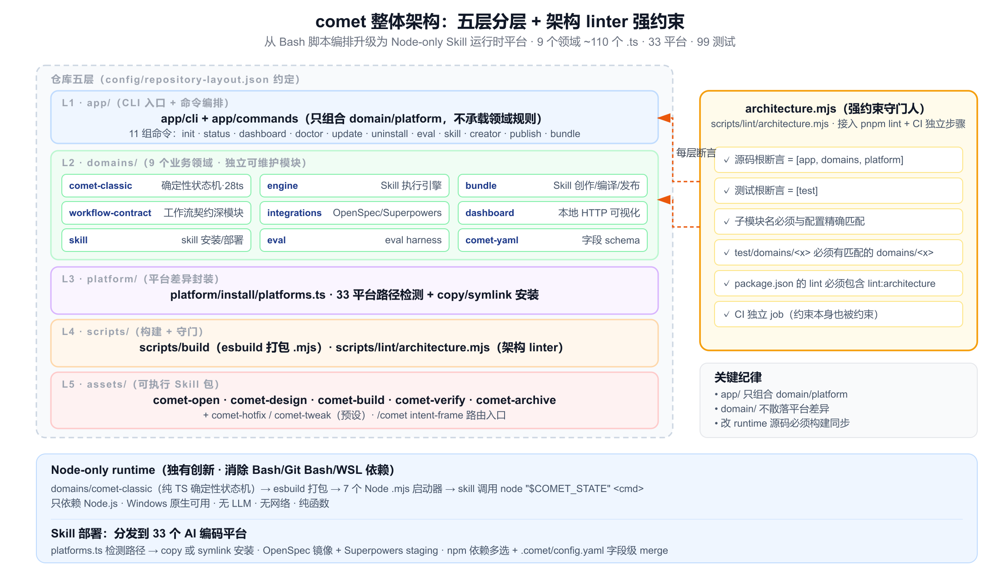
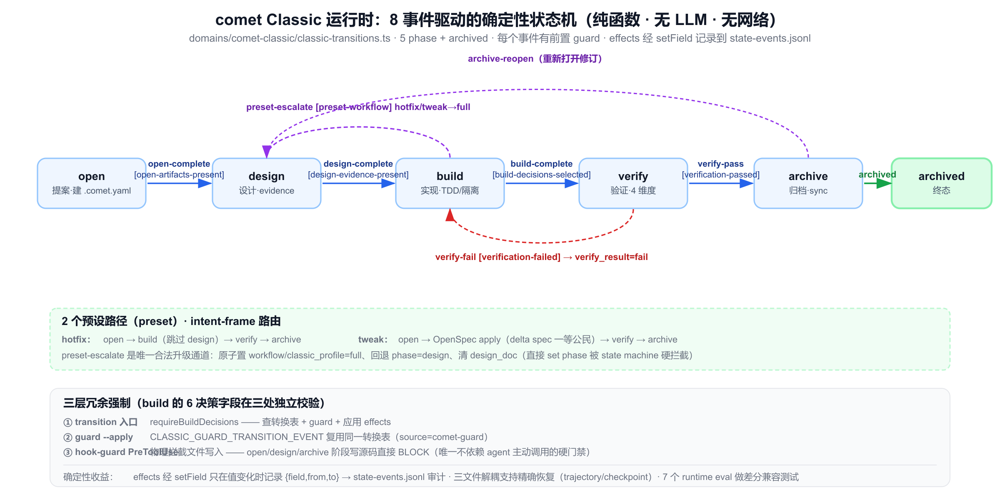
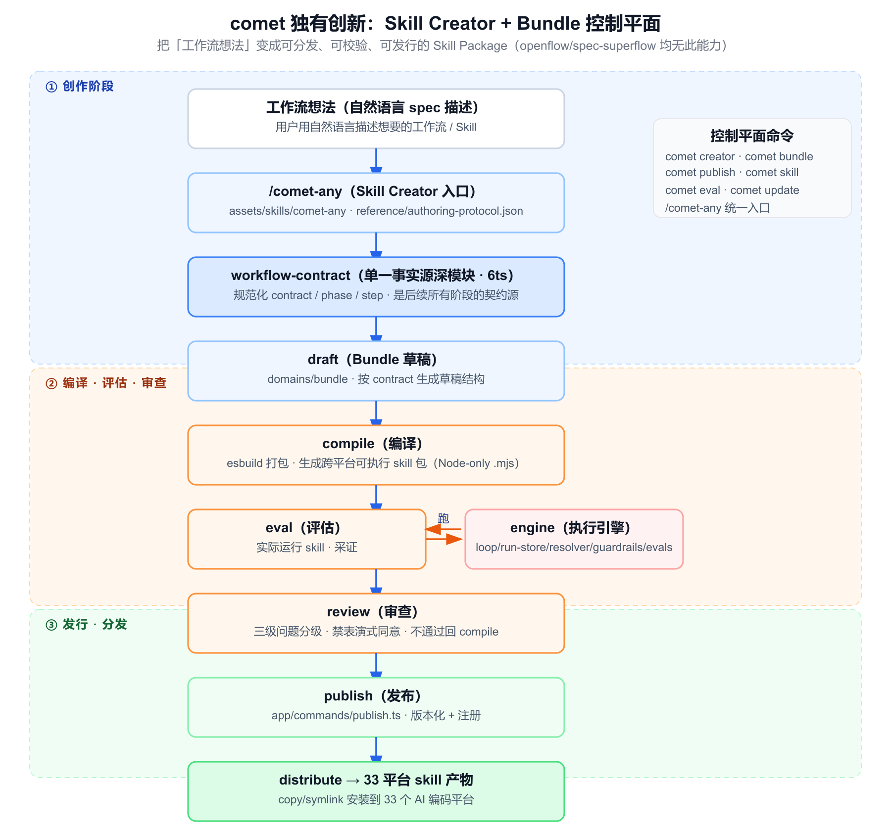

# comet 详细分析报告（实现级）

> 分析对象：`@rpamis/comet` v0.4.0-beta.1
> 仓库定位：`D:/developTools/Idea_project/coding-flow/comet`（独立 git 仓库）
> 分析粒度：实现级（已读取 `app/` / `domains/`（9 个领域共 ~110 个 .ts）/ `platform/` / `scripts/` / `assets/` / `config/` / `test/`（99 个测试）/ CI / `docs/architecture/ARCHITECTURE.md` / 主 `SKILL.md` 与全部子 skill / reference）
> 生成日期：2026-07-02

---

## 目录

1. [项目概述](#1-项目概述)
2. [设计哲学：从脚本编排层到 Node-only Skill 运行时平台](#2-设计哲学从脚本编排层到-node-only-skill-运行时平台)
3. [整体架构：五层分层 + 架构 linter 强约束](#3-整体架构五层分层--架构-linter-强约束)
4. [Classic 工作流运行时：确定性状态机（重点·工作流编排）](#4-classic-工作流运行时确定性状态机重点工作流编排)
5. [5 阶段工作流 + 2 预设路径（重点·工作流编排）](#5-5-阶段工作流--2-预设路径重点工作流编排)
6. [Node-only runtime 打包机制（重点·独有创新）](#6-node-only-runtime-打包机制重点独有创新)
7. [解耦状态机架构（重点·独有创新）](#7-解耦状态机架构重点独有创新)
8. [Skill Creator + Bundle 控制平面（重点·独有创新）](#8-skill-creator--bundle-控制平面重点独有创新)
9. [33 平台安装与 Skill 部署（重点·独有创新）](#9-33-平台安装与-skill-部署重点独有创新)
10. [辅助能力：dashboard / doctor / eval / uninstall](#10-辅助能力dashboard--doctor--eval--uninstall)
11. [工程实现质量](#11-工程实现质量)
12. [关键约束与门禁清单](#12-关键约束与门禁清单)
13. [优势、局限与实现不一致](#13-优势局限与实现不一致)
14. [与 openflow / spec-superflow 的定位差异](#14-与-openflow--spec-superflow-的定位差异)
15. [一句话本质总结](#15-一句话本质总结)

---

## 1. 项目概述

**comet** 把自己定位为 **Agent Skill Harness**——一个面向 AI 编程的"可恢复工作流 + Skill 运行时平台"。它用**一个跨平台 Node 运行时**，把 OpenSpec 工件、Superpowers 方法、Skill 创作、评估、发布串进同一个 loop：

```
开始一个变更 → 中途可恢复 → 漂移诊断 → 产出可复用 Skill → 分发
```

| 属性 | 值 | 证据 |
|---|---|---|
| npm 包名 | `@rpamis/comet` | `package.json:2` |
| 版本 | `0.4.0-beta.1` | `package.json:3` |
| tagline | "Agent Skill Harness Phase-Guarded Automation From Idea To Archive" | `app/cli/index.ts:53` |
| CLI 命令 | `comet`（`bin/comet.js`） | `package.json:18-20` |
| 顶层命令 | init / status / dashboard / doctor / update / uninstall / eval / skill / creator / publish / bundle | `app/cli/index.ts:56-523` |
| 运行时依赖 | `@fission-ai/openspec` / `@inquirer/*` / `commander` / `yaml`（7 包） | `package.json:89-98` |
| Node 版本 | `>=20` | `package.json:65-67` |
| 平台覆盖 | **33** 个 AI 编码平台 | `platform/install/platforms.ts:40-298` |
| 工作流 | 5 阶段（open/design/build/verify/archive） + 2 预设（hotfix/tweak） | `assets/skills/comet/SKILL.md:194-202` |
| 状态转换事件 | 8 个（open-complete / design-complete / build-complete / verify-pass / verify-fail / preset-escalate / archive-reopen / archived） | `domains/comet-classic/classic-transitions.ts:3-12` |
| 测试 | 99 个 `*.test.ts`（vitest，coverage 阈值 80） | `test/**`（Glob 实测） |
| License | MIT | `package.json:11` |

**一句话定位**：comet 不只是一个工作流编排器，而是一个**只依赖 Node.js、自带确定性 Skill 引擎、能创作和分发 Skill、状态可恢复可校验**的 Agent Skill 运行时平台——它把 openflow 的"轻量编排"和 spec-superflow 的"强约束融合"各自向前推进了一步，并叠加了两者都没有的 Skill 创作/分发能力。

---

## 2. 设计哲学：从脚本编排层到 Node-only Skill 运行时平台

`docs/architecture/ARCHITECTURE.md` 明确宣告 0.4.0 是一次**对外用户模型的重构**，而非小版本迭代（`ARCHITECTURE.md:7`）：

> "0.3.x 时 Comet 更像'把 OpenSpec 和 Superpowers 串起来的脚本编排层'；0.4.0 它对外应该被理解为一个**只依赖 Node.js、支持可恢复工作流、并且能够创作与分发 Skill 的运行时平台**。"

```text
0.3.x                              0.4.0
Bash 脚本编排层 (.sh × 7)           Node 命令脚本运行时 (.mjs × 7 + 共享 TS 源码)
依赖 Bash/Git Bash                  只依赖 Node.js
文档 + 脚本，agent 自由发挥          Skill 引擎（包/校验/快照/Run/Trajectory/恢复/Eval）
消费预置命令                         Skill 创作 + Bundle 分发
```

四条主线贯穿整个 0.4.0：

1. **Node-only runtime**——彻底消除 Bash/Git Bash/WSL 依赖，Windows 原生可用（`ARCHITECTURE.md:46-50`）。
2. **确定性 Skill 引擎**——把"文档 + 脚本"升级为"可执行 Skill 包"，带 Run state、Trajectory、Checkpoint、Guardrails、确定性 Eval（`ARCHITECTURE.md:52-71`）。
3. **状态机分离**——`.comet.yaml`（用户字段）与 `.comet/run-state.json`（引擎字段）与 `.comet/state-events.jsonl`（审计）三文件解耦（`ARCHITECTURE.md:106-136`）。
4. **Skill 创作 + 分发**——从"消费者工具"变成"Skill 生态平台"，能造自己的 Skill 并跨平台分发（`ARCHITECTURE.md:73-104`）。

**与同类工具的本质区别**：openflow 选"编排器"（不嵌入、调用外部），spec-superflow 选"融合器"（吸收源码、自包含）。comet 选了**第三条路**——**平台化**：既调用外部 OpenSpec CLI（如 openflow），又自带确定性引擎与状态机（强于 spec-superflow 的软+硬约束），还新增了 Skill 创作与多平台分发的完整产线（两者皆无）。代价是复杂度——`domains/` 下 9 个领域、~110 个 `.ts` 文件。

---

## 3. 整体架构：五层分层 + 架构 linter 强约束



### 3.1 五层职责划分（证据：`CLAUDE.md:29-35`、`config/repository-layout.json`）

```
bin/comet.js                 ← 3 行入口，import '../dist/app/cli/index.js'（bin/comet.js:1-3）
       │
app/                         ← CLI 入口、命令编排、用户交互（cli + commands，只组合 domain/platform）
   ├── cli/index.ts          ← commander 注册 11 组命令
   └── commands/*.ts         ← init/status/dashboard/doctor/.../bundle 等 12 个命令文件
       │
domains/                     ← 业务领域（9 个独立可维护模块）
   ├── comet-classic/        ← Classic 工作流运行时与状态机（29 个 .ts）
   ├── bundle/               ← Skill Bundle 创作/编译/发布/分发（28 个 .ts）
   ├── engine/               ← Skill 执行引擎（loop/run-store/resolver/guardrails/evals）
   ├── skill/                ← Skill 发现/安装/快照/校验（12 个 .ts）
   ├── workflow-contract/    ← 工作流契约规范化深模块（6 个 .ts）
   ├── dashboard/            ← 浏览器仪表盘（10 个 .ts + web/）
   ├── eval/                 ← 评估 harness
   ├── factory/              ← protocol → Skill Package 渲染
   └── integrations/         ← openspec / superpowers / codegraph 集成
       │
platform/                    ← 平台适配（fs / install / paths / process / version）
       │
scripts/                     ← 仓库自动化（build / lint / benchmark / install / release）
       │
assets/                      ← 发布资产 + 内置 Skill（skills/ 英 + skills-zh/ 中 + manifest.json）
```

关键纪律（`CLAUDE.md:29-47`）：`app/` 只组合 domain/platform，不承载领域规则；`domain/` 不散落平台差异；改 runtime 源码后必须构建同步生成资产，不把业务逻辑只写在生成物里。

### 3.2 架构 linter 是强约束守门人（证据：`scripts/lint/architecture.mjs`）

`architecture.mjs` 读取 `config/repository-layout.json`（`:83`），聚合校验 **14 类规则**，任一失败即 exit 非 0：

- 源码根断言为 `['app','domains','platform']`、测试根为 `['test']`（`:84-89`）
- 顶层目录白名单（`allowedTopLevelEntries` 76 项）、根目录源码文件仅允许 `build.js/eslint.config.js/vitest.config.ts`（`:91-115`）
- app/domain/platform/scripts 子模块名必须与配置 `assertArrayEquals`（`:127-135`）
- Classic runtime 入口与生成物一一对应、内置 Skill 双语根目录存在、资产 manifest 存在（`:137-154`）
- 测试归属：`test/` 子目录必须在白名单内、`test/domains/<x>` 必须有匹配的 `domains/<x>`（`:156-177`）
- **显式 ban 旧目录回归**：`src/`（`:117-119`）和 `test/ts/`（`:121-125`）
- 全仓代码文件必须落在批准根内（`:192-208`）；`AGENTS.md`/`CLAUDE.md` 必须含 `## 项目结构规范` 等约定（`:210-225`）

`lint:architecture` 被接入 `pnpm lint`（`package.json:38`）**且是 CI 独立步骤**（`.github/workflows/ci.yml:33`），`architecture.mjs:227-233` 还反向断言 `package.json` 的 `lint` 必须包含它——形成"约束本身也被约束"的闭环。

---

## 4. Classic 工作流运行时：确定性状态机（重点·工作流编排）



`domains/comet-classic/` 是 comet 工作流的内核：一个**纯确定性 TypeScript 状态机**（无 LLM、无网络），由 esbuild 打包成 Node `.mjs` 启动器供 skill 调用。

### 4.1 状态转换表：8 个事件驱动全部 phase 推进（证据：`classic-transitions.ts`）

转换表是硬编码常量 `CLASSIC_TRANSITION_TABLE`（`:34-76`），无动态注册。`applyClassicTransition` 是纯函数（`:101-159`）：

| 事件 | from→to phase | 前置 guard | 关键字段 effects |
|---|---|---|---|
| `open-complete` | open→design（full）/ build（preset） | `open-artifacts-present` | `phase` |
| `design-complete` | design→build | `design-evidence-present` | `phase` |
| `build-complete` | build→verify | `build-decisions-selected` | `phase=verify`、`verify_result=pending`、清 `verification_report`/`branch_status`（`:121-128`） |
| `verify-pass` | verify→archive | `verification-report-present` + `branch-status-handled` | `verify_result=pass`、`verified_at`（`:129-132`） |
| `verify-fail` | verify→build | `verification-failed` | `verify_result=fail`（`:133-135`） |
| `preset-escalate` | build→design | `preset-workflow` | 要求 `workflow∈{hotfix,tweak}`，否则抛错；置 `workflow=full`、`classic_profile=full`、`design_doc=null`（`:136-145`） |
| `archive-reopen` | archive→verify | `archive-not-finalized` | 已 archived 则抛错（`:146-150`） |
| `archived` | archive→终态 | `verify-result-pass` | 要求 `verify_result=pass`；`archived=true`（`:151-156`） |

effects 通过 `setField` 只在值真正变化时记录 `{field, from, to}`（`:90-99`），被 `state-events.jsonl` 审计日志消费。`CLASSIC_GUARD_TRANSITION_EVENT` 把 phase→event 映射给 guard 命令复用（`:78-84`）。

### 4.2 状态字段三层所有权（证据：`classic-state-command.ts`）

| 类别 | 内容 | set 行为 |
|---|---|---|
| `MACHINE_OWNED_FIELDS` | `run_id` / `classic_profile` / `classic_migration`（`:34-38`） | **拒绝直接 set**（`:377-379`） |
| `SETTABLE_FIELDS` | 26 个 wire 字段（workflow/phase/build_mode/...）（`:39-41`） | 白名单 + enum 校验 |
| 未知字段 | 不在上述任一 | 直接拒绝（`:380-381`） |

- **enum 校验**：`FIELD_ENUMS` 覆盖 16 字段（`:43-61`），如 `build_mode ∈ {subagent-driven-development, executing-plans, direct}`。
- **路径字段**（`design_doc/plan/verification_report/handoff_context`）强制相对路径、禁绝对路径与 `..` 穿越（`:63, 125-133`）。
- **hash 字段** `handoff_hash` 必须匹配 `^[a-f0-9]{64}$`（`:362-364`）。
- **phase 特殊保护**：`set phase` 默认拒绝，唯一逃生舱是环境变量 `COMET_FORCE_PHASE=1`（`:383-389`），且会发黄色 WARNING（`:430-435`）——这是修复损坏状态的兜底，正常流程只能走 `transition`。

### 4.3 状态命令：8 个子命令（证据：`classic-state-command.ts:1094-1140`）

| 子命令 | 职责 |
|---|---|
| `init <name> <workflow>` | 建 `.comet.yaml`，preset 自动填默认（build_mode=direct、isolation=branch、verify_mode=light、review_mode=off）（`:439-472`） |
| `get <name> <field>` | 读单字段，`auto_transition` 空值回退 config/env（`:337-350`） |
| `set <name> <field> <value>` | 白名单 + enum + phase 保护（§4.2） |
| `transition <name> <event>` | 查表 + guard + 应用 effects + **写 state-events.jsonl**（`:610-661`） |
| `check <name> <phase> [--recover]` | 入口检查；`--recover` 给恢复提示 |
| `scale <name>` | 按 tasks>3 / delta>1 / 文件>8 自动选 verify_mode（`:1049-1088`） |
| `task-checkoff <file> <text>` | 校验某任务在 tasks.md 中唯一且已勾选（`:699-720`） |
| `next <name>` | 输出 `NEXT: auto\|manual\|done` + `SKILL:`（`:663-697`） |

`next` 与 `auto_transition` 的关系（`SKILL.md:162`）：phase 推进**永远发生**（guard `--apply`），`auto_transition` **只控制下一 skill 是否自动调用**——`false` 时输出 `NEXT: manual` 仅暂停 skill 调用，不阻塞 phase 更新。

### 4.4 phase guard：每个 phase 的退出条件（证据：`classic-guard.ts`）

`--apply` 通过 `CLASSIC_GUARD_TRANSITION_EVENT` 映射到 transition 事件，复用同一转换表，source 标记为 `comet-guard`（`:797-830`）。

- **open**：proposal/tasks 非空、tasks≥1；full 额外要求 design.md（`:649-672`）
- **design**：proposal/design/tasks 存在 + **handoff context 存在且 hash 防漂移**（重新算源文件 SHA256 比对，`:545-576`）+ handoff markdown 可追溯（`Generated-by:`/`Source:`/`SHA256:` marker，`:578-602`）；full 要求 `design_doc` 录入且 frontmatter 合规（`:707-731`）
- **build**（**硬约束最密集**，`:740-764`）：isolation / build_mode / build_mode 允许性 / subagent_dispatch / tdd_mode / review_mode（仅 full）/ tasks 全勾 / plan 全勾 / proposal 存在 / 构建通过（最后跑，避免浪费，按 build_command → npm run build → mvn → cargo 优先级，`:364-384`）
- **verify**：tasks 全勾 + 验证命令通过 + verification_report 存在 + branch_status=handled（`:766-782`）
- **archive**：archived=true + proposal/design 存在 + tasks 全勾（`:784-795`）

build 的 6 个决策字段在**三处冗余强制**：state transition 入口 `requireBuildDecisions`（`:481-523`）、guard `guardBuildChecks`（`:740-764`）、`build_pause=plan-ready` 恢复逻辑（`:921-988`）。

### 4.5 hook-guard：PreToolUse 写保护（证据：`classic-hook-guard.ts`）

这是 comet 区别于 openflow（纯软约束）的**真正硬门禁**——一个 PreToolUse hook（`assets/manifest.json:51-56` 注册 matcher `Write|Edit`），在文件写入前物理拦截。

**按目标 change 自己的 phase 判断**（修复了跨 change 误判，CHANGELOG 0.3.9）：若目标路径在 `openspec/changes/<name>/` 下，该 name 即 governing change（"写自己的 change 永远允许"）；否则遍历 active changes，优先选 `blocksSourceWrites` 返回 true 的（`:129-149`）。

```typescript
// classic-hook-guard.ts:113-122
function blocksSourceWrites(governing) {
  if (governing.phase === 'open' || governing.phase === 'design' || governing.phase === 'archive')
    return true;
  return governing.phase === 'build' && governing.workflow === 'full' && !governing.designDoc;
}
```

| phase | 源码写入 | 允许的写入 |
|---|---|---|
| open / design / archive | **BLOCKED** | 各阶段对应的 artifacts |
| build（full，无 design_doc） | **BLOCKED**（`blockedMissingDesignDoc`） | — |
| build（其他）/ verify | ALLOWED | 全部 |

白名单永远允许：`.comet.yaml`/`.comet/`、`.claude/`、根目录 `*.md`（`:270-283`）。change 目录无 `.comet.yaml` 时回退 `phase=open`（最严格，`:143-145`）——覆盖 `/comet-open` 先写 artifact 再建 state 的窗口。

### 4.6 intent-frame routing：确定性的入口路由（证据：`classic-intent.ts`）

`/comet` 入口不是自由分发，而是先构造 `CometIntentFrame`（`classic-intent.ts:58-84`，含 schema_version/utterance/intent/slots/context/evidence/proposed_route），再调 `node "$COMET_INTENT" route --stdin` 拿 runtime 规范化路由。**routing 是 11 条优先级短路规则，无 LLM**（`resolveCometIntentRoute`，`:373-462`）：

| 优先级 | 条件 | route |
|---|---|---|
| 1 | `confidence < 0.7` | `ask_user` |
| 2-3 | resume + change_id 匹配/不匹配 active | `resume` / `ask_user` |
| 4 | ask_question | `out_of_scope` |
| 5 | user_explicit_workflow≠full + 有 risk signal | `ask_user`（冲突） |
| 6 | user_explicit_workflow 已设 | 该 workflow |
| 7 | 有 risk signal（new_capability/public_api/schema/cross_module） | `full` |
| 8-10 | fix_bug+existing_behavior / make_tweak / workflow_candidate（需有 evidence） | `hotfix`/`tweak`/candidate |
| 11 | 兜底 | `ask_user` |

`hasEvidence` 要求 evidence 数组有对应 field 且 quote 非空（`:330-332`）——即 agent 必须引用源文本佐证，不能空口判定。route→next_skill 映射：full→comet-open、hotfix→comet-hotfix、tweak→comet-tweak（`:348-355`）。

---

## 5. 5 阶段工作流 + 2 预设路径（重点·工作流编排）

```
/comet (intent-frame route)
  ↓
/comet-open → /comet-design → /comet-build → /comet-verify → /comet-archive
 (OpenSpec)   (Superpowers)   (Superpowers)   (Both)         (OpenSpec)
/comet-hotfix: open → build → verify → archive（跳过 brainstorming）
/comet-tweak:  open → OpenSpec apply → verify → archive（delta spec 一等公民）
```

### 5.1 comet-open（Phase 1，证据：`assets/skills/comet-open/SKILL.md`）

核心是**双初始化**：先 `openspec-new-change` 建 OpenSpec 骨架，走 Standard Artifact Loop（proposal→design→tasks），再 `node "$COMET_STATE" init <name> full` 建 `.comet.yaml`（`:91-145`）。**直接调 `/opsx:new` 会留下缺失的 .comet.yaml**，破坏后续 phase 检测（`SKILL.md:56`）。

三个阻塞决策点：① **Step 1a PRD 拆分预检**——大 PRD/多独立能力命中即推荐拆分（`:31-64`）；② **Step 1b 需求澄清完成确认**——禁一次性 `openspec-propose` 全量生成（`:66-72`）；③ **Step 1c change-name 确认**——必须是 kebab-case 英文，给 2-3 推荐名 + 自定义，明示中文输入会被转换并回显（`:74-89`）。full workflow 默认禁用 `openspec-propose`（`:95`）。退出前 `guard open --apply` 必须见 ALL PASS（`:188-194`）。

### 5.2 comet-design（Phase 2，证据：`assets/skills/comet-design/SKILL.md`）

**brainstorming 不可跳过**（full workflow 唯一铁律）：强制加载 Superpowers `brainstorming` skill，不可用则停流程（`:82-118`）。Design Doc 路径 `docs/superpowers/specs/YYYY-MM-DD-<topic>-design.md`，frontmatter 极简（`comet_change`/`role: technical-design`/`canonical_spec: openspec`，`:194-203`）。

**handoff 是脚本生成、禁止 agent 手写**（`:29-35`）：`node "$COMET_HANDOFF" <name> design --write` 读 `.comet.yaml` 的 `context_compression` 快照：
- `off`（默认）→ `design-context.{json,md}`（compact，超 80 行截断 `[TRUNCATED]`）
- `beta` → `spec-context.{json,md}`（逐字投影 delta spec，proposal/design/tasks 仅 hash 引用）

写入 `handoff_context` + `handoff_hash`（`:52-56`）。还引入 **brainstorm-summary.md 增量检查点**（`:128`）与 **Active Compaction Gate**（Step 1e 主动释放上下文，`:180-188`）。

### 5.3 comet-build（Phase 3，证据：`assets/skills/comet-build/SKILL.md`）

**plan-ready 可恢复暂停点**：Step 2 创建 plan 后给决策点 A 继续 / B 暂停切模型；选 B 则 `set build_pause plan-ready` 并停（`:79-98`）。恢复时若 `build_pause=plan-ready` 且 plan 文件存在，**不重跑 writing-plans**，确认继续后 `set build_pause null` 再进 Step 3（`:102-108`）。SKILL.md 主入口还处理"stale pause"（plan-ready 但四项已设则自动清，`comet/SKILL.md:105`）。

**4 项工作流配置单次交互决策**（`:110-135`）：
- **isolation**：branch（≤3 文件推荐）/ worktree（并行/有未提交推荐，须加载 `using-git-worktrees`）；branch 命名按 workflow 前缀（`feature/`/`hotfix/`/`tweak/`）
- **build_mode**：`subagent-driven-development`（task≥3，需 `subagent_dispatch: confirmed`）/ `executing-plans`（task≤2 或 hotfix）
- **tdd_mode**：`tdd`（业务/API 推荐）/ `direct`（hotfix/tweak 默认）
- **review_mode**：`off` / `standard`（默认）/ `thorough`

**subagent 后台 dispatch**（主窗口只协调）：`build_mode: subagent-driven-development` 需 `subagent_dispatch: confirmed`（确认平台真后台能力），否则 guard 与 transition 都 fail（`:144,168`）；无真后台则暂停改选 `executing-plans`。详见 §10.5 的 subagent-dispatch 协议。每 task 一 commit，不积攒（`:269`）。

### 5.4 comet-verify（Phase 4，证据：`assets/skills/comet-verify/SKILL.md`）

`node "$COMET_STATE" scale <name>` 自动数 task/delta/文件数定 light/full（`:35-39`）；**commit range 修正**：build 每 task 一 commit 时工作树 diff 低估，须读 plan header `base-ref` 用 `git diff --stat "$BASE_REF"...HEAD` 校正（`:58-68`）。验证报告存 `docs/superpowers/reports/YYYY-MM-DD-<name>-verify.md`，禁止手设 `verify_result: pass`（由 guard 自动转，`:187-194`）。

**branch handling** 是用户决策点：加载 `finishing-a-development-branch`，4 选项（merge/push+PR/保留/丢弃），禁止自动选（`:165-177`）。**Spec Drift 处理**：delta spec 有内容但 design doc 未反映时，单选暂停 3 选项（追加 Implementation Divergence / verify-fail 回 build / 接受偏差，`:159-163`）。**重试上限**：连续 3 次 verify-fail 后第 4 次必须暂停（`:87`）。

### 5.5 comet-archive（Phase 5，证据：`assets/skills/comet-archive/SKILL.md`）

**最终 archive 确认是阻塞决策点**：禁止未确认就跑 `comet-archive.mjs`（`:31-32`）。3 选项：确认归档 / 需调整重验（`archive-reopen` 回 verify）/ 暂不归档（`:40-44`）。`comet-archive.mjs` 一次完成 6 步：entry 校验 → Design Doc/Plan frontmatter 标注（`archived-with`）→ OpenSpec archive（delta 语义合并 main spec）→ main spec guard（防 delta-only 段标题泄漏）→ 更新 archived 状态（`:50-65`）。**归档后禁止对旧目录跑 guard**——活跃目录已不存在（`:100-102`）。脚本只移文件不 commit，须提示用户 commit（`:78-90`）。

### 5.6 hotfix vs tweak + preset-escalate 合法升级（证据：`comet-hotfix/SKILL.md`、`comet-tweak/SKILL.md`）

| 维度 | comet-hotfix | comet-tweak |
|---|---|---|
| 执行链 | open→build→root cause check→verify→archive | open→**OpenSpec apply**→verify→archive |
| delta spec | 仅当 fix 改现有 spec 验收场景才建（仅 `## MODIFIED`） | **一等公民**，正常 artifact；单独不构成升级理由 |
| build_mode/review_mode 默认 | direct / off | direct / off |
| 文件数 tripwire | >4 文件提示 | >6 文件提示 |

**upgrade-assessment 三层严格分工**（hotfix `:101-103,159`；tweak `:149-151`）：
1. **质变信号**（agent 语义识别）：cross-module / 新 capability / DB schema / 新 public API / 深层架构——命中必须暂停交用户
2. **文件数 tripwire**（仅提示交用户）：超阈值问继续预设还是升级，不自动升级
3. **验证权重**（`comet-state scale`）：只决定 light/full verification

**preset-escalate 是唯一合法升级通道**（`comet-yaml-fields.md:73`）：用户选升级后 `node "$COMET_STATE" transition <name> preset-escalate`——原子地置 `workflow/classic_profile=full`、回退 `phase=design`、清 `design_doc`，然后走正常 full 流。直接 `set phase design` 与 `set classic_profile` 都被状态机硬拦截（修复了旧升级命令被硬拦截的隐藏 bug，CHANGELOG 0.4.0）。

---

## 6. Node-only runtime 打包机制（重点·独有创新）

这是 comet 相对 openflow（依赖 bash 风格）和 spec-superflow（Node 但 guard 是单文件）最显著的工程化特征：**一套从 TypeScript 源码生成跨平台 .mjs 启动器的构建管线**。

### 6.1 每命令独立 bundle（证据：`scripts/build/build-classic-runtime.mjs`）

esbuild 把 7 个 `classic-*-entry.ts` 各自打包成 `assets/skills/comet/scripts/comet-*.mjs`（对照 `repository-layout.json` 的 `classicRuntime.entries/outputs`）：

| entry | output |
|---|---|
| `classic-state-entry.ts` | `comet-state.mjs` |
| `classic-validate-entry.ts` | `comet-yaml-validate.mjs` |
| `classic-guard-entry.ts` | `comet-guard.mjs` |
| `classic-handoff-entry.ts` | `comet-handoff.mjs` |
| `classic-archive-entry.ts` | `comet-archive.mjs` |
| `classic-hook-guard-entry.ts` | `comet-hook-guard.mjs` |
| `classic-intent-entry.ts` | `comet-intent.mjs` |

esbuild 配置（`build-classic-runtime.mjs:24-44`）：`bundle:true` / `platform:'node'` / `format:'esm'` / `target:['node20']` / `packages:'bundle'`（全打包，不外置依赖）/ `treeShaking:true`；banner 注入 `createRequire` 以支持 CJS 依赖（`:37-43`）。**新鲜度检查**（`--check`）比较磁盘文件与重打包结果的字节级差异，不一致 exit 1（`:54-73`），被 `classic-runtime.test.ts:193-209` 断言。

每个 entry 源码仅 4 行（薄封装），如 `classic-state-entry.ts`：
```ts
import { classicStateCommand } from './classic-state-command.js';
import { runClassicScript } from './classic-script-entry.js';
process.exitCode = await runClassicScript(classicStateCommand);
```

### 6.2 跨平台保证（证据：`comet-scripts.test.ts`、`ARCHITECTURE.md:46-50`）

- 测试硬断言生成物**不含** `grep|awk|sed` 等 shell 工具（`comet-scripts.test.ts:155-157`）
- hash 用 `node:crypto`、YAML 用 `yaml` 包、子进程用 `child_process`（构建/校验走 `spawnSync(cmd, { shell: true })`），消除 `sed -i`/`sha256sum` vs `shasum`/`pipefail` 等可移植性问题
- archive 调 OpenSpec 时 Windows 用 `shell:true` 解析 `.cmd`（`classic-archive.ts:296-313`）——这正是 openflow 的 `cmdExists` PATHEXT 隐患的解法

### 6.3 ⚠️ 文档与实现不一致：CLAUDE.md 描述过时

> **发现**：`CLAUDE.md:51-57` 与 `AGENTS.md:62-66` 的"脚本架构规范"描述的是**旧形态**——"launcher `import './comet-runtime.mjs'` 单 bundle 分发"。实测 `assets/skills/comet/scripts/` **不存在 `comet-runtime.mjs`**，`comet-scripts.test.ts:149-154` 显式断言该文件不存在且所有 launcher 不引用它；实际是**每命令独立 bundle**（§6.1）。`classic-runtime.test.ts:205` 也断言 manifest **不含** `comet-runtime.mjs`。
>
> **影响**：贡献者按 CLAUDE.md 增删脚本时会找不到 `comet-runtime.mjs` 入口，应同步修订 CLAUDE.md/AGENTS.md 的"脚本架构规范"与"脚本依赖关系"两节。属文档滞后于实现的漂移（类似 openflow 报告中的"已提交 skills 过期"）。

---

## 7. 解耦状态机架构（重点·独有创新）

### 7.1 三文件分离（证据：`ARCHITECTURE.md:106-136`、`classic-store.ts`）

```text
.comet.yaml                  .comet/run-state.json        .comet/state-events.jsonl
┌─────────────────┐          ┌─────────────────────┐      ┌──────────────────────┐
│ 用户字段         │          │ Run 引擎字段         │      │ 追加式审计轨迹         │
│ workflow/phase  │          │ run_id/skill/        │      │ event/source/        │
│ /build_mode...  │ ─link──► │ skill_hash/current_  │      │ from/to/effects      │
│ + run_id 链接    │          │ step/iteration/      │      │ (每次成功 transition) │
└─────────────────┘          │ pending/status...    │      └──────────────────────┘
                             └─────────────────────┘
```

- `.comet.yaml` 只写 `run_id` 链接（`applyRunStateToDocument`，`classic-state.ts state.ts:98-104`），其余 Run 字段在 `.comet/run-state.json`（camelCase JSON）
- `runStateFromDocument` 做 snake_case 严格校验，`requiredRunReference` 禁止绝对路径/盘符/`..`，所有引用锚定在 change 目录内（`state.ts:21-31`）
- trajectory 用 JSONL append（`run-store.ts:33-41`），artifacts/context/pending/checkpoint 用 atomic write（临时文件 + rename）

### 7.2 自动迁移（证据：`classic-store.ts:90-112`、`classic-migrate.ts:133-245`）

旧 change（Run 字段嵌在 `.comet.yaml`）首次读取时**懒迁移**：读到新位置 → 写 `.comet/run-state.json` → `stripLegacyRunFields` 删 yaml 中 14 个 legacy 字段（`classic-store.ts:53-71`）→ 原子重写。全量 migration（`ensureClassicRun`）会 collect evidence → resolve step → createSkillSnapshot + startRun → 写 trajectory（`run_started` + `state_migrated`）+ 加 `classic_migration=1` 标记；失败 `removeCreatedFiles` 回滚（`:240-244`）。幂等：`classicMigration≠1` 但 run 已存在则抛错（`:145-147`）。

### 7.3 Classic Resolver 渐进 Engine-native 收敛（证据：`ARCHITECTURE.md:142-164`、`classic-resolver.ts`、`classic-diagnostics.ts`）

`status`、`doctor`、`guard` 和 runtime phase transition **共享同一条 Classic Resolver 事实链**（`inspectClassicChange`，`classic-diagnostics.ts:40-77`）：collect evidence → `resolveClassicStepId` 推 currentStep（如 `full.build.execute`）→ `evaluateClassicRuntimeStep` 查 evidence 契约。三者输出一致，因为"说同一种话"——而非各拼一套展示逻辑。resolver 对畸形状态直接抛错（`archived=true` 但 `phase≠archive`、preset 进 design、archive 但 verify≠pass 等，`classic-resolver.ts:81-109`）。

### 7.4 确定性 runtime eval（证据：`classic-runtime-evals.ts:11-50`）

`STEP_EVIDENCE` 表定义 12 个 step 的证据契约（如 `full.build.execute` 要求 `build.plan`、`full.verify.branch` 要求 `verification.report`）。`evaluateClassicRuntimeStep` 仅集合查找 + 布尔归约，`missingEvidence = required.filter(!satisfied)`。**完全确定性，无 LLM/无网络**——evidence 从磁盘文件 + yaml 字段计算，step 由纯函数推导。`transitionClassicRuntimeRun`（`classic-runtime-run.ts:75-119`）每次转换写 RunState（currentStep、iteration+1）+ append trajectory（含 fromStep/toStep）。

---

## 8. Skill Creator + Bundle 控制平面（重点·独有创新）



这是 comet 区别于所有同类工具的**核心独有能力**：把"工作流想法"经 `候选发现 → confirmable proposal → 多 lane authoring → 确定性渲染 → eval 证据 → review 审批 → publish → distribute` 的完整产线，变成可评审/可验证/可分发的 Skill 产物。openflow 与 spec-superflow 都只能消费预置命令，comet 能**造自己的 Skill 并分发**。

### 8.1 workflow-contract：单一事实源深模块（证据：`domains/workflow-contract/`）

`WorkflowKind` 只两种（`types.ts:1`）：`comet-five-phase-overlay`（复用 comet 五阶段状态语义）与 `workflow-kernel`（全新内核，自带状态模型）。`normalizeWorkflowDefinition`（`normalize.ts:101`）是"输入→规范化协议"的唯一深模块：

- 仅 overlay kind 注入 `COMET_FIVE_PHASE_NODES`（8 节点：open/design/plan/execute/subagent-execute/review/verify/archive，`builtins.ts:122-229`）与 `BUILTIN_COMET_OUTPUT_SCHEMAS`（8 schema，`builtins.ts:7-120`）
- **状态模型分流**（`normalize.ts:147-162`）：overlay 复用 `.comet.yaml`；kernel 用独立 `.comet/runs/<name>/state.json`
- **Eval plan 自动派生**（`:163-172`）：`expectedNodeOrder`/`requiredOutputSchemas` 取自节点——这就是 eval/review/readiness 读同一份 protocol 的基础
- `hashWorkflowProtocol`（`hash.ts:14-18`）的 `stableValue` 递归对 key 排序后再 stringify，保证字段顺序不影响哈希

`validateWorkflowDefinition`（`validation.ts:59`）执行受保护边界：control 节点不可 override（`:120-127`）、producer override 必须满足 Output Schema（`:128-140`）、orphan-output-schema 报错（`:195-202`）——把"工作流契约"做成编译期不可违反的约束。

### 8.2 Bundle 生命周期（证据：`domains/bundle/`、`app/commands/creator.ts`/`publish.ts`/`bundle.ts`）

```
draft create/optimize → factory 候选发现 → proposal(可确认) → composition 组合
  → resolve 缺失/歧义 → generate(确定性渲染) → eval-plan/eval-record(结构化证据)
  → review-summary/readiness → review(approve) → publish → distribute(--preview/--confirm-executables)
```

关键约束：
- **hash 三处一致才 publish**（`publish.ts:82-101`）：`hashBundle(bundle)` === `state.currentHash`，且 status=review-approved 且 eval/review hash 都匹配；reference platform 编译后 required capability 全满足；原子发布（临时目录→备份→rename→重 hash 校验，失败回滚，`:139-184`）
- **stale-hash 证据不被接受**（`eval.ts:473-486`）：result 的 `draftHash` 必须 === `state.currentHash`，`evalManifestHash` 必须 === 生成的 eval.yaml 哈希；证据落盘到 `.comet/bundle-evals/<name>/<draftHash>/<evalManifestHash>/result.json`——路径本身编码"哪个 draft 的哪个 eval"
- **readiness 13 个 code**（`review-summary.ts:132-334`）：proposal 未确认、control/producer override 缺 satisfies、control-plane 文件缺失、entry SKILL.md 含 `<!-- AUTHORING PENDING -->`、unauthoredSubstanceNodes 非空、authoringReview 未通过等都是 blocker；4 状态 `published > publishable > reviewable > blocked`
- **distribute hook 非破坏性合并**（`bundle-platform.ts:234-351`）：按平台格式读-改-写 settings.json，按 command 去重追加，**绝不整体覆盖用户既有 hook**

### 8.3 Engine：Skill 执行引擎（证据：`domains/engine/`）

- **loop.ts**：`startRun` 初始化 RunState（6 个引用：pending/trajectory/context/artifacts/checkpoint）；`decide` 在 deterministic 模式找当前 step 构造 EngineAction，经 guardrails 后置 pending（adaptive 模式 decide 返回 null，需 Agent 候选）；`recordOutcome` 校验 actionId===pending（防串扰），failed 累加 retries 不前进，succeeded 推进 currentStep
- **manual-run vs standalone-run**：manual-run 拒绝 adaptive，先 `createSkillSnapshot` 冻结 Skill 包再 persist；standalone-run 是薄封装，存储在 `.comet/runs/<runId>`
- **guardrails.ts** 5 道闸门：iteration≥maxIterations / invoke_skill ref 不在 allowedSkills / call_tool 不在 allowedTools / handoff 不在 allowedAgents / confirmation 缺失 / 单 action retries 超限——allowedSkills/maxIterations 来自 `comet/guardrails.yaml`（由 factory 从 protocol.nodes 派生）
- **resolver.ts**：`DeterministicResolver` 通过 `readonlyCopy`（deepFreeze + structuredClone）保证看到的是不可变副本——Resolver 不能副作用

### 8.4 /comet-any：Skill Creator 入口（证据：`assets/skills/comet-any/SKILL.md`、`reference/authoring-protocol.json`）

10 步链路（`SKILL.md:43-54`）：resume（`comet creator guide`）→ 读偏好+候选 → 构建 proposal → 显示 confirmation（必须列 enforcement）→ 等确认 → `comet creator init --confirmed-proposal` → authoring pipeline → eval → review readiness → publish + install preview。

**authoring DAG**（`authoring-protocol.json:9-13`）：6 个 lane 分 3 波——
```
wave1: [script, reference, pause-points]   # 并行
wave2: [workflow-entry, skill-core]         # 依赖 script 契约
barrier: [skill-review]                     # 同步点，读全部 artifacts+claims
```

`merge.deterministicBackbone`（`:66-82`）列出 **15 个不可被 subagent 覆盖的路径**（protocol/scripts/bundle.yaml/comet/*.yaml/JSON），`contentLeaves`（`:83-89`）列出 5 类可 authoring 的内容叶——既支持 LLM authoring 又保证可验证一致性。skill-reviewer 是 barrier 角色，多投票（full=3 voters×4 rounds，quick=1 voter×1 round），4 个 lens（contract-fit/usability/evidence-trace/self-consistency）。

**/comet-any 与 CLI 的分工**：/comet-any 是"创建向导"（自然语言交互、proposal 构建、authoring 分派），CLI（creator/publish）是"后端状态机"（不可变状态写入、哈希校验、原子发布）。creator 命令几乎全是 bundle 的别名转发（`creator.ts:68-69`），唯一自有逻辑是 `creatorNextCommand` 调 `buildBundleResumeSummary` + `determineBundleNextAction` 输出"下一步推荐"——9 态优先级状态机 + preferenceDrift 检测，让 /comet-any 与 CLI 可任意切换、断点续接。

---

## 9. 33 平台安装与 Skill 部署（重点·独有创新）

### 9.1 33 平台路径表与检测（证据：`platform/install/platforms.ts:40-298`）

单一 `PLATFORMS` 数组定义全部 33 平台，每个含 `id/name/skillsDir/可选 globalSkillsDir/detectionPaths/openspecToolId/rulesDir/rulesFormat/supportsHooks/hookFormat`。抽样：

| 平台 id | project skillsDir | global skillsDir | 特殊点 |
|---|---|---|---|
| claude | `.claude` | `.claude` | hookFormat: claude-code |
| opencode | `.opencode` | `.config/opencode` | global 与 project 不同 |
| mimocode | `.mimocode` | `.config/mimocode` | openspecToolId 复用 opencode |
| zcode | `.zcode` | `.zcode` | 需从 .opencode/ 镜像 |
| lingma | `.lingma` | `.lingma` | Superpowers 经 claude-code staging |
| antigravity | `.agents` | `.gemini/antigravity` | global 在 gemini 子目录 |
| antigravity2 | `.agents` | `.gemini/config` | 与 antigravity 共享 .agents/（`comet init` 默认同选两者，`:396-398`） |
| cline | `.cline` | `.cline` | rulesBaseDir='' → rules 落项目根 `.clinerules/` |
| pi | `.pi` | `.pi/agent` | global 在 agent 子目录 |

`detectPlatforms`（`detect.ts:111-134`）遍历检查 detectionPaths 或 skillsDir 存在性。`selectPlatforms`（`init.ts:118-143`）用基于 `@inquirer/core` 的自定义 checkbox prompt，detected 默认勾选，支持全选/反选。

### 9.2 copy vs symlink 安装模式（证据：`domains/skill/platform-install.ts`）

- **copy**（`copyCometSkillsForPlatform`，`:221-299`）：每平台独立副本，按 manifest `skills[]` + `internalSkills[]` 从 `assets/{skills|skills-zh}/` 复制
- **symlink**（`installSkillsAsSymlink`，`:131-219`）：先复制到中央存储 `.comet/skills/`，再创建 symlink——Windows 用 `junction`（免 admin），其他用 `dir`；命令仍 copy（内容可能不同）

### 9.3 OpenSpec 镜像 + Superpowers staging（证据：`domains/integrations/`）

- **OpenSpec 镜像**：OpenSpec 硬编码写 `~/.opencode/`，OpenCode 实际读 `~/.config/opencode/`，`migrateOpenCodeOpenSpecPaths` 移文件（`openspec.ts:195-206`）；zcode/mimocode 用 `mirrorOpenCodeCompatibleOpenSpecPaths` 复制不删源（`:213-228,283-309`）
- **Superpowers staging**：skills CLI 原生支持的平台（claude/codex/opencode 等）直接 `npx skills add obra/superpowers --agent <name>`；不支持的（lingma/zcode/mimocode）走 `stageAndCopySuperpowers`——临时目录用 `--agent claude-code` staging 到 `.claude/skills`，再复制到目标平台（`superpowers.ts:167-201`）。抽出通用 staging 函数复用
- **plugin cache 检测**：claude/codex/opencode 各自的 plugin cache 路径检测已装 Superpowers，防重复安装（`detect.ts:45-100`，CHANGELOG 0.3.8/0.3.9）

### 9.4 npm 依赖多选 + .comet/config.yaml 字段级 merge（证据：`init.ts:208-264`、`platform-install.ts:943-987`）

- **依赖多选默认逻辑**：未装默认勾选、已装默认不勾选（`checked: !installed`，`init.ts:238-248`）——让用户 opt-in 升级而非强制
- **`.comet/config.yaml` 字段级 merge**（非 skip）：`mergeProjectConfig` 解析现有 config，重新渲染 managed 字段（context_compression/review_mode/auto_transition，缺失用默认、已有保留）+ 保留用户自定义字段；损坏 YAML 回退全默认（CHANGELOG 0.4.0 修复）

---

## 10. 辅助能力：dashboard / doctor / eval / uninstall

### 10.1 dashboard（证据：`domains/dashboard/`）

`startDashboardServer`（`server.ts:43-75`）默认端口 4321，被占递增最多 50 次；`GET /api/dashboard` 每次重新采集（`Cache-Control: no-store`）；`--json` 打印单次快照退出。`collectDashboardSnapshot`（`collector.ts:42-87`）并行采集 active + archived changes + git snapshot；`buildChangeItem`（`:150-315`）解析 `.comet.yaml`/tasks.md/verify report/Superpowers artifacts/Comet 中间产物，按 source 分组 artifact；前端 React + Tailwind（`package.json:31` `build:dashboard`），支持 light/dark。

### 10.2 doctor（证据：`app/commands/doctor.ts`）

`collectResults`（`:307-320`）依次检查：Comet CLI / OpenSpec CLI / Superpowers（遍历 scope bases × PLATFORMS × sentinel skills）/ 工作目录 / Skill 完整性（按 manifest `getManagedSkillPaths` 比对每平台）/ 脚本数 / CodeGraph / **`.comet.yaml` 有效性**（调 `inspectClassicChange`，`:230-276`）。**与 status 共享同一条证据路径**——valid 附 step/mode，runtimeEval fail 时 warn 给 missing evidence + next 命令，invalid 直接 fail + 错误信息 + 修复方向。

### 10.3 eval harness（证据：`domains/eval/`、`app/commands/eval.ts`、`eval/README.md`）

单一入口从仓库 `eval/` 根启动（`runEval` 用 `execFileSync('uv', args, {cwd: evalRoot})`，`eval.ts:203-209`），三种 target：comet/eval.yaml manifest / 本地 Skill 目录 / SKILL.md。`--collect` 仅发现/preflight（不跑 Claude/Docker），`--quick` 默认 `generic-skill-smoke`。pytest 框架 + Docker 隔离，task profiles（generic 7 维/comet-workflow 9 维/authoring-skill 11 维 rubric），HTML 报告 + token/cost 归因 + pass@k/pass^k 可靠性指标 + Anthropic-compatible proxy auth + 回归门（`repository-benchmarks.ts`，容忍度 10%）。

### 10.4 uninstall（证据：`app/commands/uninstall.ts`）

安全移除：支持 **7 种 hook 格式**（claude-code/qwen+qoder/gemini/windsurf/copilot/kiro）+ **3 种 rule 格式**（md/mdc/copilot instructions）。关键：用 `isManagedHookCommand`（`platform-install.ts:619-635`）过滤 Comet 管理的 hook，**保留用户自定义**；hooks 为空删 key，整体为空删 hooks key。Skills 移除仅删 manifest 管理路径，不动用户自建。多平台 checkbox 选择 vs `--force`。

### 10.5 subagent-dispatch 协议（证据：`assets/skills/comet/reference/subagent-dispatch.md`）

基于 Superpowers `subagent-driven-development` 的 Comet 扩展（冲突时 Comet 优先）。主会话仅 coordinator，禁止直接写实现代码；每 task 一个全新后台 implementer agent。**per-task checkpoint**（`openspec/changes/<name>/.comet/subagent-progress.md`）记录 stage（implementing/task-review/checkoff/done/blocked/final-review/final-fix）+ commit hash + RED/GREEN 证据 + review_mode + 未决反馈 + review-fix 轮次。**review_mode 接管 Superpowers 默认流**（防双重审查，`:111-125`）：off 全不派/standard 仅风险派/thorough 全派，change 总审查数仅由 review budget 表决定。review-fix 轮次上限：standard max 1、thorough max 2，再失败 BLOCKED 交用户。**连续执行**：task 过验收并勾选后立即 dispatch 下一个，不总结不问（`:7-17`）。

---

## 11. 工程实现质量

### 11.1 测试规模（证据：`test/**` Glob）

99 个 `*.test.ts`：`test/app/` 11、`test/domains/` 75（bundle 33、comet-classic 18、skill 13、engine 11 最多）、`test/platform/` 6、`test/scripts/` 4、`test/repository/` 3。关键：
- `comet-scripts.test.ts`：脚本契约 + 行为——断言 `comet-runtime.mjs` 不存在且 launcher 不引用它（`:149-154`）、hook-guard 错误信息保持英文（`:160-171`）、`beforeEach` 拷贝 8 个 .mjs 到临时目录隔离测试（`:181-203`）、断言生成物不含 `grep|awk|sed`（`:155-157`）
- `classic-runtime.test.ts`：CLI adapter 路由 + bundle 新鲜度检查 + standalone 执行 + state 机迁移/事件日志/task-checkoff/machine-owned 保护

### 11.2 CI（证据：`.github/workflows/ci.yml`）

三个 job：
- `build-and-test`（ubuntu/Node 20,22）：install→build→lint→**lint:architecture**→format:check→test:coverage
- `script-smoke`（ubuntu/macos/**windows**/Node 20）：跑 `comet-scripts.test.ts`
- `init-e2e`（ubuntu/macos/**windows**/Node 20,22）：全局装 openspec → 跑 `comet init`（project + global）→ **校验 33 个平台 skill 文件齐备**

coverage 阈值（`vitest.config.ts:19-24`）：branches 70 / functions 80 / lines 80 / statements 80。**Windows 在两个 job 实跑**——这正是 openflow 报告中"CI 无 Windows 矩阵是盲区"的正面解法。`eval-regression.yml` 是 skill eval 回归门（Python 3.12 + uv + Docker，容忍度 10%）。

### 11.3 benchmark（证据：`scripts/benchmark/*.mjs`）

| 脚本 | 测什么 | 关键指标 |
|---|---|---|
| `context-compression-benchmark.mjs` | off vs beta 压缩收益（3 档） | token 节省比例、Spec 漂移率、任务完成率 |
| `context-execution-benchmark.mjs` | 端到端执行（L1 设计/L2 构建/L3 全流程） | token/测试通过率/duration/cost |
| `classic-baseline-regression.mjs` | Classic runtime 7 场景行为基线 | transitionAccuracy/migrationSuccessRate/idempotencyRate/contractMatchRate，任一≠1 exit 1 |
| `comet-bundle-compatibility-benchmark.mjs` | bundle 兼容性 | skill/rule/hook/reference/path 五个 contractRate |

前两个仅开发工具，后两个有对应 test 但被 vitest exclude。

### 11.4 构建与发布（证据：`build.js`、`scripts/install/postinstall.js`、`scripts/release/prepublish-check.js`）

`build.js`（`:32-53`）三步：`buildClassicRuntime()`（esbuild）→ `runTsc()` → `buildDashboardFrontend()`（vite），任一失败 exit 1。**postinstall 非变异**——仅打印提示，`CI=true`/`COMET_NO_HINTS=1`/无 dist 跳过，catch 块绝不 break install（`postinstall.js:19-41`）。**prepublish-check** 7 类密钥模式扫描 + README 本地图片路径检查（必须绝对 URL），命中 exit 1（`prepublish-check.js:11-19,59-64`）。`prepare = husky && pnpm build`、`prepublishOnly = prepublish-check && build`。esbuild 双重锁定 0.28.1（`package.json:57-64`）避免 vite 传递依赖与直接依赖版本漂移。

---

## 12. 关键约束与门禁清单

| # | 约束 | 实现位置 |
|---|---|---|
| 1 | phase 只能由 transition 推进，set phase 需 `COMET_FORCE_PHASE=1` | classic-state-command.ts:383-389 |
| 2 | `archived=true` 要求 `phase=archive` | classic-resolver.ts:87-89 |
| 3 | preset workflow 不能进 design phase | classic-resolver.ts:91-93 |
| 4 | preset-escalate 只能从 build 触发，workflow∈{hotfix,tweak} | classic-transitions.ts:136-145 |
| 5 | build_mode=direct 仅限 hotfix/tweak 或 direct_override=true | classic-state-command.ts:499-507; classic-guard.ts:462-472 |
| 6 | subagent-driven-development 必须 subagent_dispatch=confirmed | classic-state-command.ts:508-512 |
| 7 | full workflow 离开 build 前 tdd_mode + review_mode 必选 | classic-guard.ts:484-504 |
| 8 | isolation 必须 branch/worktree | classic-state-command.ts:489-493 |
| 9 | verify-pass 要求 verification_report 存在 + branch_status=handled | classic-guard.ts:766-782 |
| 10 | archived 事件要求 verify_result=pass | classic-transitions.ts:152-154 |
| 11 | handoff_hash 不匹配源文件 hash 时拒绝（stale 检测） | classic-handoff.ts:474-484 |
| 12 | 路径字段禁止绝对路径/`..` 穿越 | classic-state-command.ts:125-133 |
| 13 | MACHINE_OWNED_FIELDS 禁止 set | classic-state-command.ts:377-379 |
| 14 | **open/design/archive phase 阻塞源码写入（hook-guard 硬门禁）** | classic-hook-guard.ts:113-122, 195-215 |
| 15 | build(full) 无 design_doc 阻塞源码写入 | classic-hook-guard.ts:233-251 |
| 16 | archive 后 main spec 不能残留 delta section | classic-archive.ts:184-204 |
| 17 | delta spec 必须经 OpenSpec merge 才能 archived=true | classic-archive.ts:296-313 |
| 18 | intent confidence<0.7 强制 ask_user | classic-intent.ts:379-382 |
| 19 | Bundle publish 前 hash 三处一致 + required capability 全满足 | domains/bundle/publish.ts:82-127 |
| 20 | stale-hash eval 证据不被接受 | domains/bundle/eval.ts:473-486 |
| 21 | workflow-contract control 节点不可 override、orphan-output-schema 报错 | domains/workflow-contract/validation.ts:120-127, 195-202 |
| 22 | 9 个用户决策点不可自动跳过（PRD 拆分/澄清/change-name/brainstorming/plan-ready/4 项配置/verify 失败/branch/archive/preset 升级） | assets/skills/comet*/SKILL.md + reference/decision-point.md |
| 23 | hook 非破坏性合并（distribute 不覆盖用户既有 hook） | domains/bundle/bundle-platform.ts:234-351 |

---

## 13. 优势、局限与实现不一致

### 13.1 优势

1. **真正的硬约束**：hook-guard PreToolUse hook 物理拦截非法写入（§4.5），远超 openflow 的纯软约束；状态机转换表 + guard + hook-guard 三层冗余强制
2. **跨平台 Node-only**：彻底消除 Bash/WSL 依赖，CI 含 Windows 矩阵 + init-e2e 33 平台校验——解决了 openflow 的 PATHEXT 隐患
3. **确定性可恢复**：状态机分离 + Resolver 事实链 + 12 step evidence + trajectory/checkpoint，长流程能精确恢复而非靠 agent 猜测
4. **Skill 创作平台**：/comet-any + Bundle 控制平面把"消费者工具"升级为"Skill 生态平台"（§8），workflow-protocol.json 单一事实源 + deterministic backbone/content leaves 分离，既支持 LLM authoring 又保证可验证
5. **33 平台 + 双语**：单源多平台分发，覆盖最广；en/zh 双语 skill + CLI i18n
6. **诊断一体化**：status/doctor/guard 共享 inspectClassicChange 证据路径，畸形状态/缺失证据作为用户可见诊断而非静默漂移
7. **工程质量高**：99 测试 + coverage 阈值 80 + 架构 linter（14 类规则）+ CI Windows 矩阵 + 4 benchmark + 安全发布检查

### 13.2 局限 / 潜在问题

1. **复杂度高**：9 个 domain、~110 个 .ts、11 组 CLI 命令、5 阶段+2 预设+Skill Creator+Bundle+Engine+eval+dashboard——概念密度极大，新用户上手成本远超 openflow。即便有 hotfix/tweak 预设，认知负荷仍重
2. **仍是 beta**：0.4.0-beta.1，0.4.0 线第一个 beta；CHANGELOG 自述"final user-visible release shape, not branch work history"——部分能力可能仍在收敛
3. **约束仍部分依赖调用**：hook-guard 是真硬门禁（PreToolUse 物理拦截），但 guard/state 转换仍需 agent 主动调用 `.mjs`；若 agent 跳过 `guard --apply` 直接编辑 `.comet.yaml`，phase 字段可被绕过（虽有 `set phase` 拒绝 + COMET_FORCE_PHASE 警告）
4. **上游绑定 OpenSpec**：archive 依赖 `openspec archive` CLI（`classic-archive.ts:296`），OpenSpec 缺失则 archive 路径断（init 时可选安装，但不像 spec-superflow 那样自包含）
5. **文档与实现漂移**：CLAUDE.md/AGENTS.md 的 runtime 架构描述过时（§6.3）

### 13.3 实现不一致

> ⚠️ **CLAUDE.md / AGENTS.md runtime 描述过时**（§6.3 已述）：两文件的"脚本架构规范"描述"launcher import comet-runtime.mjs 单 bundle"，实际是每命令独立 bundle，`comet-runtime.mjs` 不存在且被测试硬断言锁死。建议同步修订。

> ⚠️ **handoff stale 检测的严格性**：`classic-handoff.ts:474-484` 在已记录 hash 与当前不一致且非 recovering 时抛错——这是防漂移的正确设计，但意味着 OpenSpec artifact 在 design 阶段被任何微调后必须重新生成 handoff，否则 guard design 阶段会失败。对 agent 而言是强约束，需理解。

---

## 14. 与 openflow / spec-superflow 的定位差异

| 维度 | openflow | spec-superflow | **comet** |
|---|---|---|---|
| 范式 | 编排器（调用外部） | 融合器（吸收源码） | **平台（Node 运行时 + 引擎 + 创作）** |
| 运行时 | Bash 风格依赖检测 | Node guard.mjs（零运行时依赖） | **Node-only（.mjs × 7 + TS 源码）** |
| 状态机 | 扁平推断（5 phase + 文件推断） | 严格转移（8 状态 + guard exit） | **确定性 TS 状态机（8 事件 + Resolver + 12 step evidence）** |
| 约束力 | 纯软（事后冲突检测） | 软+硬（铁律 + guard.mjs） | **软+硬+物理（铁律 + guard + hook-guard PreToolUse）** |
| 平台 | 4 | 7+ | **33** |
| Skill 创作 | 无（消费预置） | 无（消费预置） | **有（/comet-any + Bundle + 发布分发）** |
| 可恢复 | 文件推断回退 | 哈希过时检测 | **Run state + trajectory + checkpoint 精确恢复** |
| 测试 | ~32 | 1 e2e | **99 + coverage 80 + Windows CI** |
| 复杂度 | 极小 | 中 | **大（9 domain/~110 .ts）** |

（详细的选型决策矩阵见 [工作流对比分析报告](./工作流对比分析报告.md)）

---

## 15. 一句话本质总结

> **comet 是一个只依赖 Node.js、自带确定性 Skill 引擎的 Agent Skill 运行时平台——它用 8 个 transition 事件驱动的纯确定性 TypeScript 状态机（Resolver + 12 step evidence，无 LLM）做工作流门禁，用 PreToolUse hook-guard 物理拦截非法写入（真正的硬约束），用 .comet.yaml + run-state.json + state-events.jsonl 三文件解耦状态并支持精确恢复，并用 /comet-any + workflow-protocol.json 单一事实源 + Bundle 控制平面把"工作流想法"变成可评审/可验证/可分发给 33 个平台的 Skill 产物；它同时吸收了 openflow 的"调用外部 OpenSpec"和 spec-superflow 的"自带约束引擎"，再叠加两者都没有的 Skill 创作分发能力——代价是 9 个领域 ~110 个 .ts 文件的工程复杂度，是一台工程化程度远超同类的"AI 编程工作流 + Skill 平台"重型机器。**
