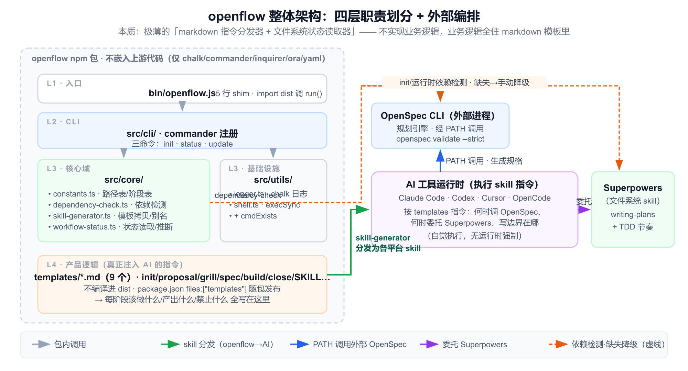
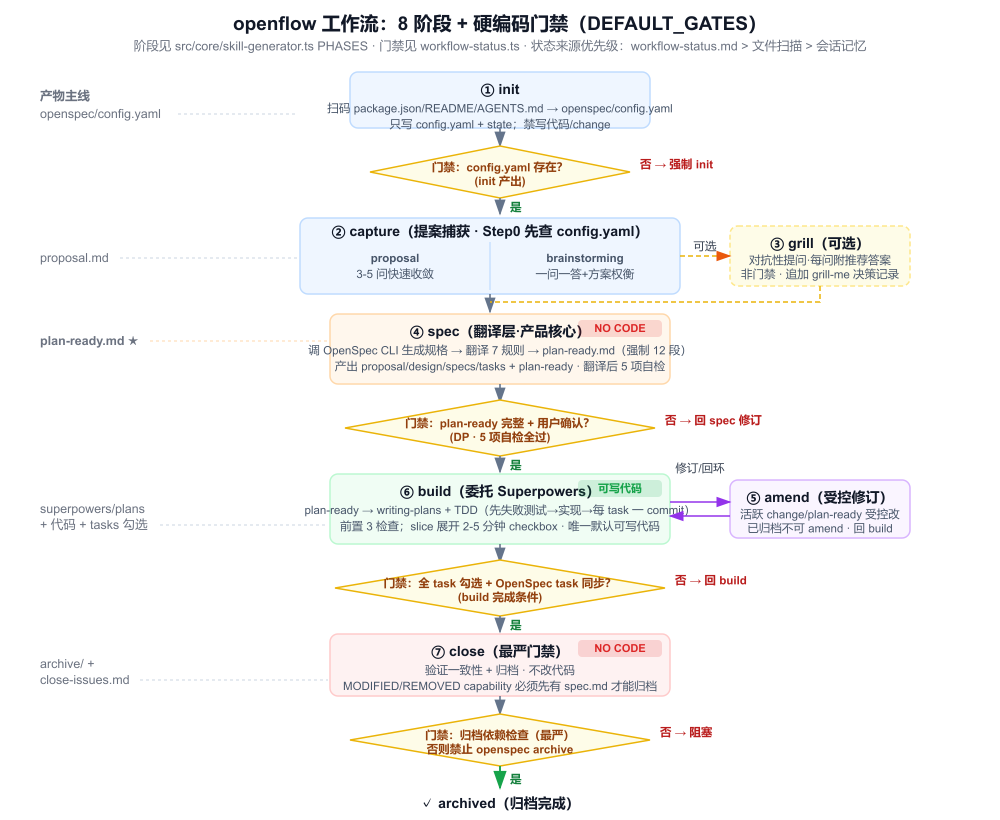
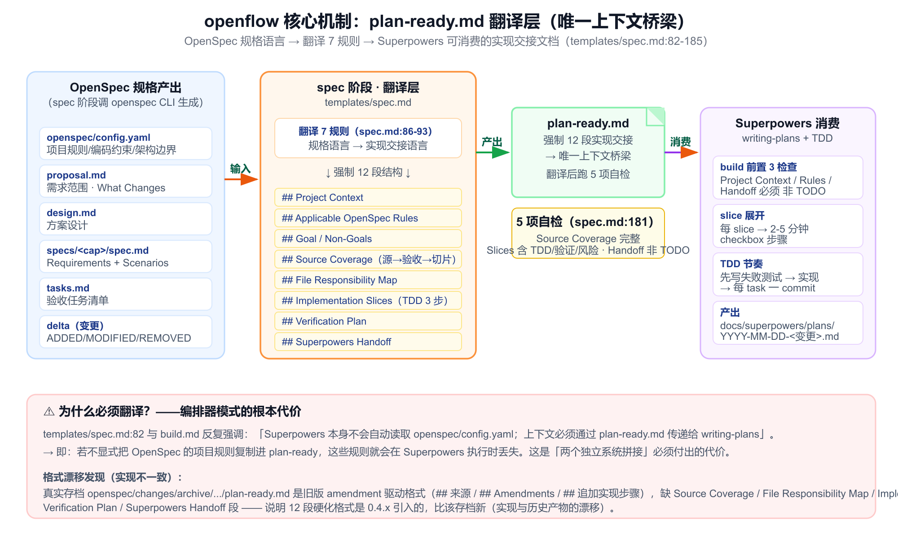

# openflow 详细分析报告（实现级）

> 分析对象：`@lininn/openflow` v0.4.5-beta.0
> 仓库定位：`D:/developTools/Idea_project/coding-flow/openflow`
> 分析粒度：实现级（已读取全部 `src/`、`templates/`、`scripts/`、配置、测试与真实产物）
> 生成日期：2026-06-30

---

## 目录

1. [项目概述](#1-项目概述)
2. [设计哲学：编排器模式（Standalone Orchestrator）](#2-设计哲学编排器模式standalone-orchestrator)
3. [整体架构：四层职责划分](#3-整体架构四层职责划分)
4. [工作流阶段机：8 阶段逐一详解](#4-工作流阶段机8-阶段逐一详解)
5. [核心机制：plan-ready.md 翻译层](#5-核心机制plan-readymd-翻译层)
6. [状态管理：workflow-status.md](#6-状态管理workflow-statusmd)
7. [依赖策略与降级：双层检测](#7-依赖策略与降级双层检测)
8. [多平台 skill 生成机制](#8-多平台-skill-生成机制)
9. [OpenSpec / Superpowers 集成细节](#9-openspec--superpowers-集成细节)
10. [工程实现质量](#10-工程实现质量)
11. [关键约束与门禁清单](#11-关键约束与门禁清单)
12. [优势、局限与实现不一致](#12-优势局限与实现不一致)
13. [适用场景建议](#13-适用场景建议)
14. [一句话本质总结](#14-一句话本质总结)

---

## 1. 项目概述

**openflow** 是一个面向 agentic development（AI 代理驱动的开发）的工作流编排器，把 **OpenSpec**（规划引擎）与 **Superpowers**（执行纪律）串成一条 spec-driven 的完整路径：

```
项目上下文 → 需求捕获 → 规格 → 翻译 → 实现 → 验证 → 归档
```

它为 **Claude Code / Codex / Cursor / OpenCode** 四类 AI 工具生成本地 skill，并保持 OpenSpec 变更状态可见，把需求工件翻译成可执行的 Superpowers 交接文档。

| 属性 | 值 | 证据 |
|---|---|---|
| npm 包名 | `@lininn/openflow` | `package.json:2` |
| 版本 | `0.4.5-beta.0` | `package.json:3` |
| CLI 命令 | `openflow` (`bin/openflow.js`) | `package.json:5-7` |
| 运行时依赖 | `chalk` / `commander` / `inquirer` / `ora` / `yaml` | `package.json:45-51` |
| Node 版本 | `>=18.0.0` | `package.json:33` |
| License | MIT | `package.json:27` |
| 工作流阶段 | 8（init / proposal / brainstorming / grill / spec / amend / build / close） | `src/core/skill-generator.ts` PHASES |

**一句话定位**：openflow 是一个**极薄的"markdown 指令分发器 + 文件系统状态读取器"**——它不实现任何业务逻辑，而是把 9 个精心设计的工作流模板分发到各 AI 工具的 skills 目录，让 AI 在运行时按这些指令去调用外部的 OpenSpec CLI 与 Superpowers skill。

---

## 2. 设计哲学：编排器模式（Standalone Orchestrator）

openflow 与同类工具（如 spec-superflow）的本质区别在于融合策略。

### 2.1 编排器 ≠ 融合器

`README.zh-CN.md` 明确宣告（证据：`README.zh-CN.md:181`）：

> "openflow 是**独立编排器** — 不捆绑、不分叉、不嵌入任何项目的代码。依赖在 init/运行时检测，任一缺失时降级为手动模式。"

这意味着：

- **不嵌入上游代码**：`package.json:45-51` 的 dependencies 只有 5 个 UI/解析库，**没有任何 OpenSpec 或 Superpowers 代码依赖**。
- **OpenSpec 是外部进程**：运行时通过 `PATH` 调用 `openspec` CLI。
- **Superpowers 是文件系统中的 skill**：通过检测 `<skillsDir>/writing-plans/SKILL.md` 是否存在来判断。

### 2.2 业务逻辑全部住在 markdown 里

openflow 自身代码只做三件事：**依赖检测、模板生成、状态仪表盘**。真正的"产品逻辑"——每个阶段该做什么、产出什么、禁止什么——全部写在 `templates/*.md` 这 9 个 markdown 文件里，由 AI 执行。

这是一个关键判断：openflow 的"可审计性"和"AI 工具无关性"由此而来，但"约束力"也由此成为**软约束**——依赖 AI 忠实执行 markdown 指令，无运行时强制（详见 §12）。

---

## 3. 整体架构：四层职责划分



```
bin/openflow.js            ← 5 行入口，仅 import 并调用 run()
       │
src/cli/index.ts           ← commander 三命令注册（init/status/update）
       │
src/cli/{init,status,update}.ts   ← 命令业务实现
       │
src/core/                  ← 核心域逻辑
   ├── constants.ts            ← 路径表、阶段表
   ├── dependency-check.ts     ← OpenSpec/Superpowers 检测
   ├── skill-generator.ts      ← 模板拷贝/别名生成
   └── workflow-status.ts      ← 状态读取/推断/冲突检测
       │
src/utils/                 ← 基础设施
   ├── logger.ts               ← chalk 日志
   └── shell.ts                ← execSync 封装 + cmdExists
       │
templates/*.md (9 个)      ← 真正的"产品逻辑"，注入给 AI 的指令
```

### 3.1 入口极薄（证据：`bin/openflow.js:1-5`）

```js
#!/usr/bin/env node
import { run } from '../dist/cli/index.js';
run();
```

### 3.2 CLI 注册（证据：`src/cli/index.ts`）

`run()` 仅约 24 行：用 `createRequire(import.meta.url)` 读 `package.json` 取版本号（版本单源），注册 `initCommand / statusCommand / updateCommand` 三个子命令。

> ⚠️ **死配置发现**：`logger.ts` 支持 `--debug` 标志，但**没有任何命令调用 `logger.configure({debug:true})`**，属未接线的死配置。

### 3.3 模板不编译，随包发布（证据：`src/core/skill-generator.ts:18-27`）

```ts
TEMPLATES_DIR = path.resolve(__dirname, '..', '..', 'templates')
```

从 `dist/core/` 回溯两层到 `templates/`，模板**不编译进 dist**，靠 `package.json` 的 `files: ["templates"]` 一并发布。这与"指令即产品"的哲学一致——模板是源，不是构建产物。

### 3.4 模块协作流

| 命令 | 协作链 |
|---|---|
| `init` | `checkDependencies()` → 写 `openspec/config.yaml` → `generateSkills()` 拷贝模板 → `writeState()` 写 `.openflow/state.json` |
| `status` | `readState()` → `checkDependencies()` → `findActiveChanges()` → `loadWorkflowStatus()`（含 synthesize 回退）→ `detectWorkflowConflicts()` → `renderWorkflowDashboard()` |
| `update` | `readState()` → `generateSkills()`（用 state 里的 tools，**不接受 CLI flag**）→ `writeState()` |

---

## 4. 工作流阶段机：8 阶段逐一详解



阶段定义见 `src/core/skill-generator.ts` 的 PHASES 数组。下表是 8 阶段的全景：

| 阶段 | 输入 | AI 指令核心 | 强制约束 | 产出工件 | Gate→下一阶段 |
|---|---|---|---|---|---|
| **init** | `package.json`/README/AGENTS.md | 扫码 + 交互生成项目上下文 | 只写 `config.yaml` + state；禁写代码/change | `openspec/config.yaml` | → proposal/brainstorming |
| **proposal** | config.yaml、用户回答 | 3-5 问快速收敛 | **Step 0**：先检查 config.yaml，禁止先扫码/建 change | `proposal.md` + `workflow-status.md` | → 可选 grill / spec |
| **brainstorming** | git 历史/代码结构 | 一问一答 + 2-3 方案权衡 | 必须讨论取舍 | 同 proposal（Capture Mode: brainstorming） | → 可选 grill / spec |
| **grill**（可选） | proposal.md | 对抗性提问，每问附推荐答案 | 可随时跳过，非门禁 | proposal.md 追加 `## grill-me 决策记录` | → spec |
| **spec** | proposal.md/config.yaml/specs/ | 调 OpenSpec CLI + **翻译层** | **一条代码都不许写** | proposal/design/specs/tasks + `plan-ready.md` | plan-ready 完整 + 用户确认 → build |
| **amend** | 活跃 change/plan-ready.md | 受控修订 | 已归档不可 amend | 同 spec 产出 | → 回 build |
| **build** | plan-ready.md | 委托 Superpowers `writing-plans` + TDD | **唯一默认可写代码阶段** | `docs/superpowers/plans/*.md` + 代码 + tasks 勾选 | 全部勾选 + OpenSpec task 同步 → close |
| **close** | plan-ready.md/实现产物 | 验证一致性 + 归档 | **不改代码** | archive + `close-issues.md` | 归档完成 |

### 4.1 init 阶段：项目上下文沉淀

init 扫描仓库，捕获项目的目的、编码规则、架构边界、实现约束，写入 `openspec/config.yaml`，使后续 proposal/spec/build 有项目级指导。config.yaml 的强制结构（证据：`templates/init.md` + `src/cli/init.ts getDefaultOpenSpecConfig`）：

- `schema: spec-driven`
- `language:`（artifacts / detection / appliesTo）
- `context:`（Purpose / Tech Stack / Architecture / Code Style / Testing / Constraints）
- `rules:`（specs / design / tasks / implementation / artifacts）

### 4.2 proposal 阶段：快速捕获 + 硬性前置

`templates/proposal.md` 的 **Step 0 硬规则**：必须先检查 `config.yaml` 是否存在且语言匹配，禁止先扫码或建 change 目录。这一步防止 AI 在没有项目上下文的情况下凭空写需求。

### 4.3 grill 阶段：可选的压力测试

`/openflow grill` 是可选的——proposal 已清晰时跳过；需要对隐含假设施压时启用。每问必附 AI 推荐答案，决策追加到 proposal.md 的 `## grill-me 决策记录`。**grill 不是门禁**，spec 阶段会检查 grill-me 是否存在（门禁见 §11）。

### 4.4 spec 阶段：翻译层（产品核心）

详见 §5。这是 openflow 最重的设计：调用 OpenSpec CLI 生成规格，再翻译成给 Superpowers 的 `plan-ready.md`。

### 4.5 build 阶段：委托 Superpowers

详见 §5.3。委托 Superpowers `writing-plans` 以 plan-ready.md 为输入生成实现计划，按 TDD 节奏执行。

### 4.6 close 阶段：最严门禁——归档依赖检查

`templates/close.md` Step 6 是 openflow 最严的硬约束：对含 `MODIFIED/REMOVED/RENAMED Requirements` 的 capability，必须确认 `openspec/specs/<capability>/spec.md` 已存在；不存在则**禁止 `openspec archive`**，阻塞信息：

> "归档被变更顺序阻塞：当前变更修改 `<capability>`，但主规格尚不存在。请先归档创建该规格的变更 `<前置变更名>`，再重新运行 /openflow close。"

这一约束源于 OpenSpec 的 delta 规则（见 §8），历史上确实踩过坑（见 §8.3 真实案例）。

---

## 5. 核心机制：plan-ready.md 翻译层



`plan-ready.md` 是 openflow 设计的**唯一上下文桥梁**——把 OpenSpec 的规格语言翻译成 Superpowers 能消费的实现交接文档。

### 5.1 为什么需要翻译层

`templates/spec.md:82` 与 `templates/build.md` 反复强调一个根本事实：

> "Superpowers 本身不会自动读取 `openspec/config.yaml`；上下文必须通过 `plan-ready.md` 传递给 `writing-plans`，再写入 `docs/superpowers/plans/...md`。"

即：**如果不显式把 OpenSpec 的项目规则复制进 plan-ready，这些规则就会在 Superpowers 执行时丢失**。这是编排器模式（两个独立系统拼接）必须付出的代价，也是 plan-ready.md 存在的根本理由。

### 5.2 翻译 7 规则（证据：`templates/spec.md:86-93`）

1. 覆盖每个 requirement/scenario/task；不得只转写 tasks.md 标题
2. 每个 Task 拆成可独立交付的 implementation slices；每 slice 可被 writing-plans 展开为 2-5 分钟步骤
3. 每 slice 必须指明改动文件/测试文件/验证命令/依赖前置/完成标准
4. 明确 TDD 期望（先写失败测试→实现→验证）
5. **按执行依赖排序，不是按功能模块排序**
6. 记录来源路径和 task/requirement/scenario 映射
7. 不确定项写入 `## Blockers / Clarifications`，不得隐藏为模糊步骤

### 5.3 plan-ready.md 强制 12 段结构

spec.md:103-177 定义了 plan-ready 的强制结构：

```
# 实现计划
## 来源
## Project Context
## Applicable OpenSpec Rules
## Goal
## Non-Goals
## Source Coverage          ← OpenSpec 源 → 验收点 → 实现切片 的映射表
## File Responsibility Map  ← 文件 → 操作 → 职责 → 关联 slice
## Implementation Slices    ← 含 TDD 3 步、验证命令、完成标准、风险回滚
## Verification Plan
## Blockers / Clarifications
## Superpowers Handoff
```

其中 **`## Superpowers Handoff`** 段（spec.md:171-177）要求生成的 Superpowers plan 必须：

- 基于 plan-ready 生成 `docs/superpowers/plans/YYYY-MM-DD-<变更名>.md`
- **复制/压缩 Project Context + Applicable Rules** 到 plan header
- 使用 Superpowers plan header + checkbox + 2-5 分钟步骤 + RED-GREEN-REFACTOR
- **不得出现 TBD/TODO/"适当处理"/"类似上一步" 等占位话术**
- 不得省略 Source Coverage 中任何验收点

### 5.4 翻译后 5 项自检（spec.md:181-185）

Source Coverage 覆盖度 / 新 capability 是否只 ADDED / 是否仍有占位 / 每 slice 是否齐全 / build 是否可不重解需求。

### 5.5 build 如何消费 plan-ready

`templates/build.md` Step 3 强制对 plan-ready 做 3 项前置检查（Project Context / Applicable Rules / Superpowers Handoff 必须非 TODO），缺失则停止并要求回 spec。执行时把每 slice 展开成 2-5 分钟 checkbox 步骤，按 TDD 节奏（先失败测试→实现→每 task 一 commit）推进。

> ⚠️ **格式漂移发现**：真实存档 `openspec/changes/archive/2026-06-04-refactor-arch-optimize/plan-ready.md` 是**旧版 amendment 驱动格式**（`## 来源` / `## Amendments` / `## 追加实现步骤`），**缺少**当前 spec.md 强制的 Source Coverage / File Responsibility Map / Implementation Slices(TDD) / Verification Plan / Superpowers Handoff 段。说明硬化格式是 0.4.x 引入的，比该存档新——这是实现与历史产物的漂移。

---

## 6. 状态管理：workflow-status.md

openflow 用 `openspec/changes/<change-id>/workflow-status.md` 跟踪每个变更的状态，并提供**双源解析 + 文件推断回退 + 冲突告警**。

### 6.1 域模型（证据：`src/core/workflow-status.ts`）

```ts
WorkflowPhase = 'capture' | 'spec' | 'build' | 'close' | 'archived'
CaptureMode   = 'proposal' | 'brainstorming' | 'none'
WorkflowOverallStatus = 'ready_for_next_phase' | 'in_progress' | 'blocked' | 'completed' | 'pending'
WorkflowGateStatus = 'pending' | 'passed' | 'failed' | 'blocked' | 'not_applicable'
```

### 6.2 六个硬编码门禁（DEFAULT_GATES）

```ts
const DEFAULT_GATES = [
  'Requirements captured', 'Specs validated', 'Plan ready',
  'Implementation complete', 'Verification complete', 'Archived'
];
```

### 6.3 双源解析

`loadWorkflowStatus`：优先读 `workflow-status.md`（`inferred:false`）；缺失则 `synthesizeWorkflowStatus` 从文件存在性推断（`inferred:true`）。

### 6.4 文件推断回退阶梯

当 workflow-status.md 缺失时，按以下优先级从文件系统推断（证据：`synthesizeWorkflowStatus`）：

| 优先级 | 文件系统条件 | 推断状态 | 推荐下一步 |
|---|---|---|---|
| 1 | 实现计划全勾选 | `build / ready_for_next_phase` | `/openflow close` |
| 2 | 计划存在未全勾 | `build / in_progress` | `/openflow build` |
| 3 | `plan-ready.md` 存在 | `spec / ready_for_next_phase` | `/openflow build` |
| 4 | `proposal.md` 存在 | `capture / ready_for_next_phase` | `/openflow spec` |
| 5 | 全无 | `capture / pending` | `/openflow proposal` |

### 6.5 三层状态来源优先级

`templates/SKILL.md` 定义状态来源优先级：**workflow-status.md > 文件系统扫描 > 会话记忆**（会话记忆"只能用于续接，不可作为事实来源"）。

### 6.6 状态冲突告警（detectWorkflowConflicts）

`detectWorkflowConflicts` 检测状态声称与实际工件的矛盾，例如：

> "workflow-status.md says Plan ready = passed, but plan-ready.md is missing."
> "workflow-status.md says Phase = archived, but the change directory is still active."

冲突不被静默覆盖，必须写入 Conflicts 字段。

> ⚠️ **状态解析的潜在缺陷**（基于源码）：
> - `findImplementationPlanFiles` 用 changeId **子串匹配**文件名——若一个 changeId 是另一个的前缀会误匹配。
> - `allCheckboxesChecked` 对**零 checkbox 文件返回 false**（视为未完成），可能误判。
> - `readOpenSpecTasks` 把所有任务硬编码为 `status:'pending'`，**忽略实际 `[x]` 勾选状态**。
> - `parseTable` 用 `lines.slice(2)` 跳过表头，**假设恰好一行分隔符**，无分隔行会丢数据行。

---

## 7. 依赖策略与降级：双层检测

openflow 对两个上游依赖采用**完全不同的检测策略**，并提供双层（init 时 + 运行时）降级。

### 7.1 两依赖对比

| 依赖 | 检测策略 | 可自动安装 | 降级方式 |
|---|---|---|---|
| **OpenSpec** (`@fission-ai/openspec`) | `cmdExists('openspec')` PATH 遍历 + `openspec --version` | 是（`npm i -g`） | 手动创建 `openspec/changes/` 目录 |
| **Superpowers** | 文件存在性：`<skillsDir>/writing-plans/SKILL.md`（本地+全局） | 否（手动 plugin install） | 手动拆解 plan-ready.md 步骤 |

### 7.2 cmdExists 实现（证据：`src/utils/shell.ts:44-59`）

```ts
export function cmdExists(cmd: string): boolean {
  if (!/^[A-Za-z0-9._-]+$/.test(cmd)) return false;   // 防注入
  const pathValue = process.env.PATH;
  if (!pathValue) return false;
  return pathValue.split(path.delimiter).some((dir) => {
    const candidate = path.join(dir, cmd);            // ← 不追加 PATHEXT
    try { fs.accessSync(candidate, fs.constants.X_OK); return true; }
    catch { return false; }
  });
}
```

> ⚠️ **Windows PATHEXT 隐患**：`path.join(dir, 'openspec')` 不尝试 `.cmd`/`.ps1`/`.bat` 扩展名。npm 全局装在 Windows 上通常是 `openspec.cmd`，裸名可能匹配不到——**本项目正运行在 win32**，值得验证。CI 也无 Windows 矩阵（见 §10），是盲区。

### 7.3 init 时降级（证据：`src/cli/init.ts`）

- OpenSpec 未装 → `inquirer` 询问是否自动安装；跳过则日志 "spec phase will use manual fallback"。
- Superpowers 未装 → 仅打印安装提示（中文），日志 "build phase will use manual fallback"。
- **不阻断**：继续生成 skills。

### 7.4 运行时降级（证据：`src/core/skill-generator.ts:168`）

`injectRuntimeDepCheck` 把依赖检查表注入到 build.md 的静态文本，由 AI 在运行时执行：

```
| Superpowers writing-plans | ...是否存在 writing-plans/SKILL.md | 降级为手动拆解 plan-ready.md 中的步骤，逐条执行 |
```

> ⚠️ **死参数发现**：`injectRuntimeDepCheck` 和 `injectSpecRuntimeCheck` 函数签名接收 `depStatus` 参数但**从未使用它**——注入文本是静态的，实际检测发生在 AI 运行时。参数具有误导性。

### 7.5 状态文件迁移（证据：`dependency-check.ts getStateFileCandidates`）

读两个候选 `.openflow/state.json`（新）/ `.claude/openflow-state.json`（legacy），**只写新位置**——单向静默迁移。

---

## 8. OpenSpec / Superpowers 集成细节

### 8.1 OpenSpec 调用方式

通过 PATH 执行外部 CLI（证据：`src/cli/init.ts` exec(`openspec init`) + spec.md/close.md 指令）：

- `openspec init --tools ...`
- `openspec validate <变更名> --strict`
- `openspec archive <变更名> --yes`

### 8.2 OpenSpec 输出格式

openflow 读取并依赖以下 OpenSpec 产物：

- `proposal.md` / `design.md`
- `specs/<capability>/spec.md`（delta：`## ADDED|MODIFIED|REMOVED|RENAMED Requirements`）
- `tasks.md`（`- [ ]` / `- [x]` checkbox，编号形如 `1.2.3`）

### 8.3 delta 结构自检（真实踩坑案例）

spec.md Step 2 的 delta 规则：新建 capability 的 delta **只能** `## ADDED Requirements`，禁含 MODIFIED/REMOVED/RENAMED；只有主规格已存在才允许后三者。

真实归档失败案例（证据：存档 `2026-06-04-refactor-arch-optimize/plan-ready.md` 第二条 amendment）：

> "`openspec archive refactor-arch-optimize --yes` 要求新建 target spec 只能包含 `ADDED Requirements`，原 `exec() Error Handling` 写在 `MODIFIED Requirements` 下导致归档失败"

这验证了 delta 规则是真实存在的硬约束，close 阶段的归档依赖检查（§4.6）正是为这类场景设计的防线。

### 8.4 Superpowers 集成

- **检测**：文件存在性 `<skillsDir>/writing-plans/SKILL.md`（非 CLI）。
- **委托点**：build 阶段调用 `writing-plans` skill，以 plan-ready.md 为输入生成 `docs/superpowers/plans/YYYY-MM-DD-<变更名>.md`。
- **checkpoint**：基于该 plan 文件的 checkbox 状态做断点恢复，**依赖文件系统而非 AI 记忆**。
- **并行**：build 允许派子代理（引用 `subagent-driven-development`）。

---

## 9. 多平台 skill 生成机制

### 9.1 四工具路径表（证据：`src/core/constants.ts:21-26`）

```ts
export const TOOL_PATHS = {
  claude:   { skillsDir: '.claude/skills',    commandsDir: '.claude/commands' },
  codex:    { skillsDir: '.codex/skills' },
  cursor:   { skillsDir: '.cursor/skills' },
  opencode: { skillsDir: '.opencode/commands' },   // opencode 的 skillsDir 实际是 commands
};
```

### 9.2 平台不对称性

- **claude** 是唯一有 `commandsDir` 的（虽然生成器实际未用此字段生成额外内容）。
- **opencode** 的 skillsDir 指向 `commands`，故生成在 `.opencode/commands/openflow/`——commands 目录本身把每个 `.md` 暴露为可发现命令（命令树形式）。
- **codex/cursor** 仅 skillsDir。

### 9.3 可见性别名机制（PHASE_ALIAS_TOOLS）

- 所有 4 平台生成：`<dir>/openflow/{SKILL.md, init.md, ..., close.md}` 共 9 文件。
- **仅 claude/codex/cursor** 额外生成 8 个阶段别名 skill（`openflow-<phase>/SKILL.md`），使输入 `openflow` 时命令面板能补全出各阶段。
- **opencode 不生成别名**——其 commands 目录本身已把每个 `.md` 暴露为可发现命令，扁平文件即命令树。

别名 skill 是薄重定向包装：5 步指令把调用改写为 `/openflow <phase> $ARGUMENTS`，再读 `openflow/SKILL.md` + `openflow/<phase>.md`。对 `init/proposal/brainstorming` 三阶段别名额外注入"项目初始化守卫"步骤（检查 config.yaml）。

### 9.4 模板缺失硬失败

`resolveSkillTemplateContent` 缺失模板时抛 `Missing openflow template: <path>`，无内联回退——这是 0.3.3-beta.1 移除 `getInlineTemplate()` 的结果（证据：CHANGELOG.md）。

---

## 10. 工程实现质量

### 10.1 TypeScript 配置（证据：`tsconfig.json`）

`strict:true`、`target:ES2022`、`module/moduleResolution:Node16`、emit `.d.ts`。Node16 解析要求 TS 源码 import 用 `.js` 后缀。

### 10.2 测试覆盖（约 32 个用例）

| 测试文件 | 用例数 | 覆盖范围 |
|---|---|---|
| `dependency-check.test.ts` | 3 | `checkOpenSpecInitialized` 三场景 |
| `skill-generator.test.ts` | 9 | 主回归套件：codex/opencode 全量生成、plan-ready 翻译、grill-me 门禁、archive 阻塞 |
| `workflow-status.test.ts` | 12 | 推断阶梯、冲突检测、dashboard 渲染 |
| `constants.test.ts` | 2 | TOOL_PATHS 形状 + 四工具 SKILL.md 生成 |
| `init.test.ts` | 6 | config.yaml 脚手架幂等性 |
| `shell.test.ts` | — | cmdExists/file/dir/exec |

> ⚠️ **测试策略关键局限**：所有 `generateSkills` 测试写进 `mkdtempSync` 临时目录，**从不校验已提交的 `.claude/.codex/.cursor/.opencode/` 树**。因此测试证明"生成器能产出 init 阶段 skill"，但无法发现"已提交产物未含 init"（见 §12.1）。

### 10.3 CI（证据：`.github/workflows/ci.yml`）

`ubuntu-latest` / Node 22 / 全分支 / 四步 `npm ci` → `lint` → `build` → `test`。**无 coverage 阈值、无 OS 矩阵、无 `openspec validate` 步、无 Windows 测试**。

### 10.4 postinstall（证据：`scripts/postinstall.js` 全文 12 行）

纯 `console.log` 打印 banner，**无任何文件操作/钩子/telemetry**——故意非变异。

### 10.5 版本管理

运行时单源——`createRequire(import.meta.url)` 读 package.json（证据：`src/cli/index.ts` + `openspec/specs/project/spec.md` Requirement 1）。CHANGELOG 覆盖 0.3.2→0.4.3，但 `add-openflow-init-phase` 工作未入 CHANGELOG。

---

## 11. 关键约束与门禁清单

| # | 约束 | 实现位置 |
|---|---|---|
| 1 | init 阶段禁写代码/change，只写 config.yaml | `templates/init.md` + SKILL.md |
| 2 | proposal Step 0：必须先检查 config.yaml | `templates/proposal.md` |
| 3 | spec 阶段"一条代码都不许写" | `templates/spec.md` |
| 4 | plan-ready.md 必须含 Source Coverage + File Responsibility Map | spec.md 翻译规则 |
| 5 | 新建 capability delta 只能 ADDED Requirements | spec.md Step 2 + amend.md + close.md |
| 6 | 翻译按执行依赖排序，非功能模块排序 | spec.md 翻译规则 5 |
| 7 | 不得出现 TBD/TODO/"适当处理" 占位话术 | spec.md Superpowers Handoff |
| 8 | build 是唯一默认可写代码阶段 | SKILL.md + build.md |
| 9 | plan-ready.md 锁定，Superpowers 不重解需求 | build.md |
| 10 | TDD 铁律：先失败测试→实现，每 task 一 commit | build.md Step 4 |
| 11 | build 中需求变更→切 amend，不直接改代码 | SKILL.md + build.md |
| 12 | close 不改代码，差异只记 close-issues.md | close.md |
| 13 | 归档依赖检查：主规格不存在则阻塞 archive | close.md Step 6 |
| 14 | 已归档变更不可 amend | amend.md |
| 15 | "就按这个做"/"继续"等话术不授权跨入 build | SKILL.md 反模式守卫 |
| 16 | cmdExists 必须 `/^[A-Za-z0-9._-]+$/` 校验 | openspec/specs/project/spec.md Req 3 + shell.ts:45 |
| 17 | 模板缺失硬抛错，无内联回退 | skill-generator.ts |
| 18 | workflow-status 冲突不得静默覆盖 | SKILL.md + workflow-status.ts |

---

## 12. 优势、局限与实现不一致

### 12.1 优势

1. **真正的松耦合**：5 个 UI 库依赖，零上游代码依赖，OpenSpec/Superpowers 任一缺失都能降级——安装/迁移成本低。
2. **指令即产品**：所有业务逻辑在 markdown，可读、可审计、AI 工具无关（支持 4 工具）。
3. **状态自校验**：workflow-status 双源 + 冲突检测，避免 AI 记忆漂移。
4. **强门禁链**：从写入边界到归档依赖检查，多道防线防止"边写代码边改需求"。
5. **上下文不丢失**：plan-ready.md 显式承载 Project Context/Rules，弥补 Superpowers 不读 config.yaml 的鸿沟。
6. **优雅的极简**：自身代码量小，复杂度低，易于理解和维护。

### 12.2 局限 / 潜在问题

1. **Windows PATHEXT 隐患**（`shell.ts:51`）：`cmdExists('openspec')` 不尝试 `.cmd` 扩展，win32 上 npm 全局包可能检测失败。
2. **死参数**：`injectRuntimeDepCheck`/`injectSpecRuntimeCheck` 接收 `depStatus` 但不用，运行时检测完全靠 AI 读静态文本。
3. **`--debug` 未接线**：logger 支持但无命令激活。
4. **状态解析的多个脆弱点**：子串匹配、零 checkbox 误判、`readOpenSpecTasks` 硬编码 pending、`parseTable` slice(2)（见 §6.6）。
5. **编排器脆弱性（根本性）**：核心依赖 AI 服从 markdown 指令；若 AI 工具不严格执行写入边界，约束即失效——**只有事后冲突检测，无运行时强制**。

### 12.3 实际行为与 README/产物的不一致

> ⚠️ **★ 最重大发现：已提交 skills 过期**
>
> `templates/SKILL.md`（10.7KB）是含 `/openflow init` 的 **8 阶段版**（argument-hint 含 `init`，有 init.md），但 4 个已提交平台产物（`.claude/.codex/.cursor/.opencode/.../SKILL.md` 各 6.2KB，md5 完全相同 `f388557c...`）是 **7 阶段版**——无 init、无 `openflow-init` 别名、无 init.md。活跃变更 `add-openflow-init-phase/tasks.md` 全勾 `[x]`，但**模板编辑后从未重新 `generateSkills` 提交到平台目录**。回归测试写 tmpDir 故测不出。这违反了 `openspec/project.md` 的约束 "Keep generated skill templates in sync across tool targets"。

其他漂移：

- **plan-ready.md 格式漂移**：存档真实产物是旧 amendment 格式，缺当前 spec.md 强制的多段结构（§5.5）。
- **workflow-status.md 格式漂移**：真实存档用 2 列 Summary 表 + 4 列 Tasks 表；测试 fixture 用 bullet-list + 5 列 Tasks 表——解析器对真实表格形态的鲁棒性未被测试覆盖。
- **`openspec/specs/project/spec.md` 的 Purpose 仍是 TBD**：文件自注 "Update Purpose after archive" 但归档后从未更新。

---

## 13. 适用场景建议

### ✅ 适合 openflow 的场景

- **已在使用 OpenSpec + Superpowers 的团队**：openflow 几乎零成本地把两者串成一条流水线，不改变既有工具栈。
- **多 AI 工具混用**：同一套指令分发给 Claude Code / Codex / Cursor / OpenCode，保持一致性。
- **希望工作流可读、可审计、可自定义**：业务逻辑全在 markdown，团队可自行编辑模板。
- **轻量偏好**：不喜欢"大而全"的自包含插件，倾向于"小而专"的编排器。

### ❌ 不适合 openflow 的场景

- **需要运行时硬约束**：openflow 的约束是软的（依赖 AI 执行指令），无法防止"AI 不听话"。
- **Windows 环境**：cmdExists 的 PATHEXT 隐患可能导致 OpenSpec 检测失败（需验证）。
- **希望开箱即用、不预装上游**：openflow 必须先装 OpenSpec（+ 推荐 Superpowers）才能发挥完整能力。

---

## 14. 一句话本质总结

> **openflow 是一个极薄的"markdown 指令分发器 + 文件系统状态读取器"——它把 9 个精心设计的工作流模板拷贝到各 AI 工具的 skills 目录，让 AI 在运行时按这些指令去调用外部的 OpenSpec CLI 和 Superpowers skill，并用 `workflow-status.md` + 文件推断做状态机门禁；产品 100% 的业务逻辑住在 markdown 模板里（尤其是 spec.md 的"翻译层"和 build.md 的 Superpowers 委托），自身代码仅负责依赖检测、模板生成和状态仪表盘——这是一种"指令即代码、编排器不嵌业务"的优雅但脆弱的编排模式。**
