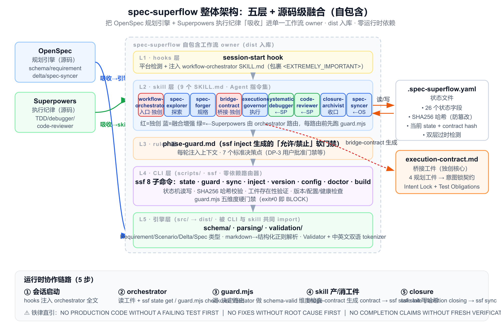
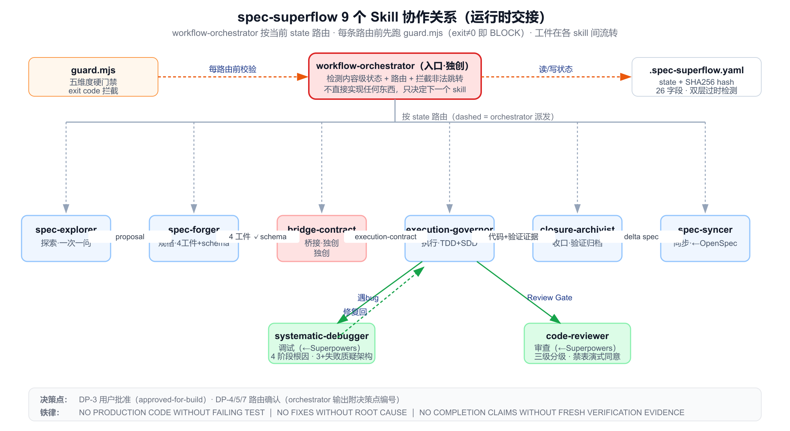
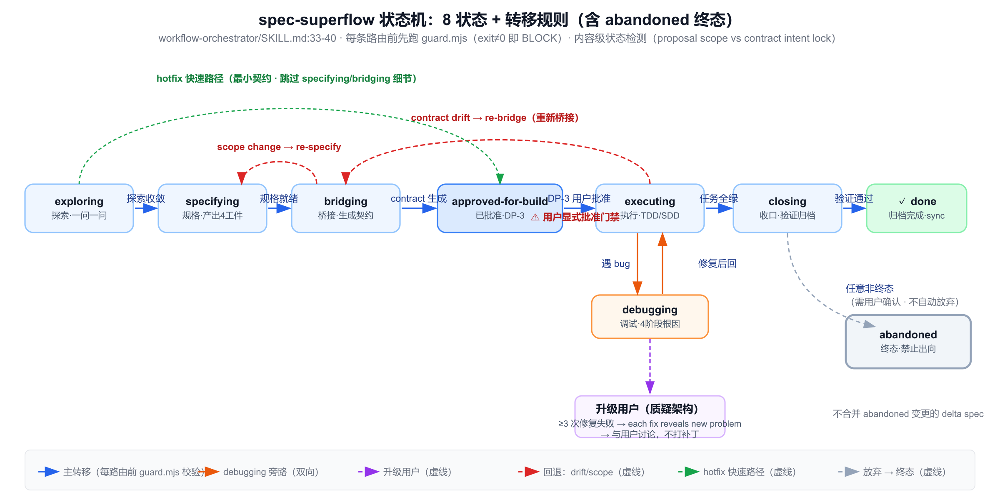

# spec-superflow 详细分析报告（实现级）

> 分析对象：`spec-superflow` v0.6.0
> 仓库定位：`D:/developTools/Idea_project/coding-flow/spec-superflow`
> 分析粒度：实现级（已读取全部 9 个 SKILL.md、`src/` 引擎源码、`scripts/` CLI、guard/hooks/rules/specs/docs/templates）
> 生成日期：2026-06-30

---

## 目录

1. [项目概述](#1-项目概述)
2. [设计哲学：源码级融合（Source-Level Fusion）](#2-设计哲学源码级融合source-level-fusion)
3. [整体架构：五层职责划分](#3-整体架构五层职责划分)
4. [9 个 Skill 详解](#4-9-个-skill-详解)
5. [状态机：8 状态机与转移规则](#5-状态机8-状态机与转移规则)
6. [核心独创：execution-contract.md 桥接层](#6-核心独创execution-contractmd-桥接层)
7. [嵌入式引擎实现（schema / parsing / validation）](#7-嵌入式引擎实现schema--parsing--validation)
8. [执行纪律（TDD / SDD / Review Gate）](#8-执行纪律tdd--sdd--review-gate)
9. [守卫机制（硬门禁 + 软门禁 + 状态文件 + 决策点）](#9-守卫机制硬门禁--软门禁--状态文件--决策点)
10. [快速路径（hotfix / tweak）](#10-快速路径hotfix--tweak)
11. [CLI 工具链（ssf）](#11-cli-工具链ssf)
12. [多平台支持](#12-多平台支持)
13. [工程实现质量](#13-工程实现质量)
14. [关键约束与铁律清单](#14-关键约束与铁律清单)
15. [优势、局限与实现不一致](#15-优势局限与实现不一致)
16. [适用场景建议](#16-适用场景建议)
17. [一句话本质总结](#17-一句话本质总结)

---

## 1. 项目概述

**spec-superflow** 是一个 spec-first 的 AI 编程工作流插件，把 **OpenSpec 的规划引擎**与 **Superpowers 的执行纪律**通过一个**桥接工件 `execution-contract.md`** 融合进单一工作流。它不是把两者并排安装再手工拼接，而是把核心引擎和能力**吸收**进一个自包含的工作流 owner。

| 属性 | 值 | 证据 |
|---|---|---|
| npm 包名 | `spec-superflow` | `package.json:2` |
| 版本 | `0.6.0` | `package.json:3` |
| CLI 命令 | `ssf` / `spec-superflow` | `package.json:7-10` |
| 运行时依赖 | **零**（仅 devDep `typescript`） | `package.json:40-42` |
| Node 版本 | `>=22` | `package.json:37-39` |
| Skill 数量 | 9 | `skills/` |
| 状态机 | 8 状态（README 误称 7，见 §5） | `workflow-orchestrator/SKILL.md:33-40` |
| 平台支持 | 7+（Claude Code/Cursor/Codex/OpenCode/Copilot CLI/Gemini CLI/Trae） | `README.md` |

**一句话定位**：spec-superflow 是一个**以 `execution-contract.md` 桥接层为独创核心、用内嵌 TS 引擎重实现 OpenSpec 规划能力、用 9 个 SKILL.md 铁律改写 Superpowers 执行纪律、靠三层守卫强制 8 状态机纪律、零运行时依赖跨 7+ 平台的源码级融合工作流插件**。

---

## 2. 设计哲学：源码级融合（Source-Level Fusion）

### 2.1 "源码级融合"的具体含义

基于 `src/` 与 skill 证据，"融合"分三个动作：

**(1) 吸收 OpenSpec 的引擎——重新实现为内嵌 TS 引擎**：

- `src/schema/`：Requirement / Scenario / Delta / Spec 类型体系
- `src/parsing/`：markdown → 结构化的正则解析器
- `src/validation/`：Validator + 中英文 tokenizer

`README.md:437` 自述："v0.2.0 源码级融合，新增引擎层 src/"。

**(2) 吸收 Superpowers 的纪律——改写为 SKILL.md 指令**（而非运行时依赖）：

- `execution-governor/SKILL.md:49-51` 直引 `NO PRODUCTION CODE WITHOUT A FAILING TEST FIRST`
- `systematic-debugger/SKILL.md:18-19` 直引 `NO FIXES WITHOUT ROOT CAUSE INVESTIGATION FIRST`
- `closure-archivist/SKILL.md:22-24` 直引 `NO COMPLETION CLAIMS WITHOUT FRESH VERIFICATION EVIDENCE`

**(3) 独创三项**：

- `execution-contract.md` 桥接层（`bridge-contract/SKILL.md:8` 自称 "the defining layer of spec-superflow"）
- 内容级状态检测（`workflow-orchestrator/SKILL.md:87-114`，比较 proposal scope vs contract intent lock，而非文件时间戳）
- 内嵌中英文双语 tokenizer（`src/validation/tokenizer.ts`）

### 2.2 自包含

`package.json:40-42` 仅 devDependency `typescript ^5.9.3`，零运行时 npm 依赖。`README.md:91` 明示 "self-contained, does not require OpenSpec or Superpowers"。

**一句话哲学**：规划阶段产出可验证的 spec，执行阶段用 contract 锁死意图，纪律不是约定而是 skill 内嵌的铁律。

---

## 3. 整体架构：五层职责划分



```
┌─ hooks 层（session-start）：平台检测 + 注入 workflow-orchestrator SKILL.md 为会话上下文
├─ skill 层（9 个 SKILL.md）：Agent 指令集，由 workflow-orchestrator 路由
├─ rules 层（phase-guard.md）：ssf inject 生成的"允许/禁止操作"软门禁，每轮注入上下文
├─ CLI 层（scripts/，ssf）：状态机读写、哈希校验、工件验证、版本/配置/健康检查
└─ 引擎层（src/ → dist/）：类型 + 解析 + 验证，被 CLI 和 skill 共同 import
```

### 3.1 协作链路

1. 会话启动 → hooks 注入 orchestrator 全文（包裹在 `<EXTREMELY_IMPORTANT>` 内）
2. orchestrator → 读工件内容 + 调 `ssf state get` / `guard.mjs check` 决定路由
3. guard.mjs → 调 `dist/` 的 Validator 做 schema-valid 维度
4. skill 产出/消费工件 → bridge-contract 生成 contract 后调 `ssf state init` 写哈希
5. closure → `ssf state transition closing` → `ssf sync`

### 3.2 关键设计：dist 入库

引擎层编译产物 `dist/` 被提交进仓库（证据：`CLAUDE.md` Design Decisions、`cmd-doctor.mjs:74-84` 有 dist 检查），使 `git clone` 后无需 build 即可运行验证脚本。测试也从 `dist/` import（`e2e.test.ts:13`）。

---

## 4. 9 个 Skill 详解



| # | Skill | 阶段 | 职责 | 来源 |
|---|---|---|---|---|
| 1 | `workflow-orchestrator` | 入口 | 内容级状态检测、8 状态路由、阻止非法跳转 | **独创** |
| 2 | `spec-explorer` | 探索 | 一次一问 + 方案对比 + 推荐 | 融合增强 |
| 3 | `spec-forger` | 规格 | 产出 4 工件 + Schema 引擎实时验证 | 融合增强 |
| 4 | `bridge-contract` | 桥接 | 解析引擎自动提取 4 工件 → execution-contract.md | **独创** |
| 5 | `execution-governor` | 执行 | TDD 铁律 + SDD 子代理驱动 + Review Gate | 融合增强 |
| 6 | `systematic-debugger` | 调试 | 4 阶段根因分析，3+ 失败质疑架构 | ← Superpowers |
| 7 | `code-reviewer` | 审查 | 三级问题分级，禁止表演性同意 | ← Superpowers |
| 8 | `closure-archivist` | 收口 | 验证前完成铁律 + 归档 + 风险总结 | 融合增强 |
| 9 | `spec-syncer` | 同步 | Delta Spec → 主规范智能合并 | ← OpenSpec |

### 4.1 workflow-orchestrator（入口，最核心）

- **职责**：检测状态 + 路由 + 拦截非法跳转。**不直接实现任何东西**。
- **内容级状态检测算法**（`SKILL.md:87-114`，独创核心）：
  - **过时 contract 检测**：读 proposal.md 的 `## What Changes`/`## Scope`，读 contract 的 Intent Lock，若 proposal scope 超出 contract 的 scope fence → stale；若 contract 引用了 proposal 不再有的能力 → stale。
  - **过时工件检测**：proposal 列的能力若无对应 spec 文件 → stale；spec 文件存在但不在 proposal scope → drift。
  - **过时 spec-vs-tasks**：`specs/` 的每个 SHALL/MUST 要求必须在 `tasks.md` 有对应任务。
- **路由规则**：每条路由前先跑 guard.mjs（exit≠0 即 BLOCK）。例如路由到 bridge-contract 前 `guard.mjs check <dir> specifying bridging --json`。
- **模式检测**（v0.6.0）：先 `ssf state get <dir> workflow`，hotfix/tweak 各有阈值校验，超阈值自动升级为 full。
- **铁律**：实现前必须有 contract；contract 过时必须回退 bridge；bug 必须经 systematic-debugger；abandoned 是终态，禁止任何出向转换；不自动放弃（需用户确认）；不合并 abandoned 变更的 delta spec。
- **输出标准**：必须显式给出 当前状态 / 选择理由（引用具体文件内容）/ 下一个 skill；附决策点编号（DP-3/DP-4/DP-5/DP-7）。

### 4.2 bridge-contract（桥接层，独创核心）

详见 §6。

### 4.3 execution-governor（TDD + SDD，执行纪律核心）

- **四条核心法则**：
  - Law 1 **Contract First**：实现开始后 chat history 不再是 source of truth，contract 才是。
  - Law 2 **TDD 铁律**：`NO PRODUCTION CODE WITHOUT A FAILING TEST FIRST`。附 RED-GREEN-REFACTOR 表 + 8 条 "Red Flags 自检"。
  - Law 3 **Review Before Drift**：batch 间用 review gate，阻断 logic defects / spec violations / missing tests / scope expansion。
  - Law 4 **Rewind on Contract Break**：新行为 / 接口变更 / 设计假设失效 → 回 specifying 或 bridging。
- **执行模式自动选择**：任务数 ≤3 且无跨模块依赖 → Inline；否则 SDD。阈值可配置（`get-config execution.inlineThreshold`，默认 3）。
- **SDD 工作流**：
  - Pre-Flight Plan Review：dispatch 前扫 contract+tasks 找冲突，一次性 batched 提问。
  - Worktree Isolation：在 main/master 时建议 `git worktree add`。
  - **模型选择策略**（`SKILL.md:153-162`）：机械实现用快模型；集成判断用标准模型；架构设计用最强模型；review 匹配 diff 规模；最终全分支 review 用最强模型。**必须显式指定 model**，省略会继承会话最贵模型。
  - 每任务循环：dispatch implementer → 处理 DONE/DONE_WITH_CONCERNS/NEEDS_CONTEXT/BLOCKED → 用 `review-package` 生成 review 包并 dispatch task reviewer → Critical/Important 问题 dispatch fix → 干净后追加一行到 `.superpowers/sdd/progress.md`。
  - **文件交接**：task brief / report file / review package 都走文件，避免粘贴占用 controller context。
  - **进度台账**：`.superpowers/sdd/progress.md` 跨 context compaction 存活。
- **Inline 模式**：≤3 任务单模块，当前会话执行。3 次修复失败或超出声明文件路径 → 建议升级 SDD。
- **Tweak 直编模式**：跳过 TDD 铁律，直接改文件，每次改后做文件完整性校验。

### 4.4 spec-explorer（探索）

- **一次一问**（明确反对一次问多个）。
- **偏好多选题**（降认知负荷）。
- **必提 2-3 方案 + 取舍 + 推荐**（禁止只给单路径）。
- 6 项清晰才交接：change name / problem / scope / non-goals / success criteria / 是否需拆分。
- 铁律：不产实现代码。

### 4.5 spec-forger（规格）

- tasks.md 强约束：必须有 `## File Structure`（每个文件一句话职责）、`## Interfaces`（cross-batch Consumes/Produces）、每任务含精确文件路径（Create/Modify+行号）、展开 5 步 TDD、每步 ≤5 分钟、**零占位符规则**（禁 TBD/TODO/"implement later"）。
- 质量门：4 工件交叉对齐（proposal 定 scope / specs 定可观测行为 / design 定技术形态 / tasks 定执行顺序）。
- 生成后跑 schema validation，不过不交接。

### 4.6 systematic-debugger（调试）

4 阶段：Root Cause → Pattern → Hypothesis → Implementation。**升级规则**：≥3 次修复失败 → 质疑架构（"each fix reveals new problem" 模式）→ 与用户讨论而非继续打补丁。10 条 Red Flags + 8 条 Rationalization 表。

### 4.7 code-reviewer（审查）

双职责：**Part 1 Requesting**（dispatch reviewer subagent，三级严重度 Critical/Important/Minor）；**Part 2 Receiving**（6 步响应：READ→UNDERSTAND→VERIFY→EVALUATE→RESPOND→IMPLEMENT）。**禁止表演式同意**（禁 "You're absolutely right!" / "Great point!" / 任何感谢表达；改为直接陈述修复）。

### 4.8 closure-archivist（收口）

**铁律**：`NO COMPLETION CLAIMS WITHOUT FRESH VERIFICATION EVIDENCE`。Gate Function 5 步（IDENTIFY/RUN/READ/VERIFY/CLAIM）。**禁用词**：未给证据前禁 "should"/"probably"/"seems to"/"Done!"。三维报告（Completeness/Correctness/Coherence，verdict PASS/CONDITIONAL/FAIL）。

### 4.9 spec-syncer（同步）

详见 §11.2 的实现背离说明。

---

## 5. 状态机：8 状态机与转移规则



### 5.1 状态数不一致（重要 finding）

> ⚠️ **README 与实现的漂移**
>
> - `README.md:178` 与 `README.md:334` 宣称 **"7 状态机"**。
> - 但 `workflow-orchestrator/SKILL.md:33-40` 列 **8 个**（含 `abandoned`），`docs/state-machine.md:56-62` 有 `abandoned` 专节，`specs/state-machine/spec.md:5-7` 明文 "Eight-State Workflow"，`CHANGELOG.md:437` 自述 "v0.4.0...8 状态机（含 abandoned 终态）"。
>
> **结论**：实际是 8 状态，README 的 "7" 是 v0.1 时代遗留未更新。

### 5.2 转移矩阵

```
exploring → specifying → bridging → approved-for-build → executing → closing
                ↑              ↑             |                 ↑    |
                |              |         debugging ────────────┘    |
                |              +------------------------------------+
                |              (contract drift → re-bridge)
                +---------------------------------------------------+
                     (scope change → re-specify)
(任意非终态) → abandoned (终态，禁止任何出向转换)
```

guard.mjs 的 TRANSITION_CHECKS 定义了 9 条合法转换，未列出的转换 exit=1 拦截（`guard.mjs:73-81`）。

### 5.3 强制回退条件

新 scope 出现 / 关键接口变更 / 设计假设错误 / 当前工件不再定义预期行为 / contract intent lock ≠ proposal scope（证据：`docs/state-machine.md:87-94`）。

### 5.4 debugging 旁路

executing 遇 bug → 进 debugging → 4 阶段根因 → 修复后回 executing；3+ 失败 → 质疑架构 → 升级用户。

### 5.5 abandoned 终态铁律

不允许从 abandoned 出向转换；不允许从 closing/abandoned 进 abandoned；不自动放弃（需用户确认）；不合并 abandoned 的 delta spec。

---

## 6. 核心独创：execution-contract.md 桥接层

`bridge-contract/SKILL.md:8` 自述 "the defining layer of spec-superflow"。这是 spec-superflow 区别于其他工作流的最核心设计。

### 6.1 设计动机

规划工件（proposal/specs/design/tasks）和执行之间存在语义断层：规划语言描述"要什么"，执行需要"做什么、按什么约束、何时 review"。`execution-contract.md` 把 4 个规划工件**压缩成单一执行握手**，锁死意图，使执行阶段有一个可检查的契约。

### 6.2 contract 结构（7 大节）

| 节 | 内容 | 来源 |
|---|---|---|
| **Intent Lock** | Change name / Problem / In scope / Out of scope | proposal |
| **Approved Behavior** | Requirements summary / Key scenarios / Acceptance checks | specs |
| **Design Constraints** | Architecture / Interface / Dependency / Data 四类 | design |
| **Task Batches** | 每批 Objective/Inputs/Outputs/Done when | tasks |
| **Test Obligations** | 必先失败测试的行为 / 边界用例 / 回归敏感区 | specs + design |
| **Verification Dimensions** | 三维表（verdict 待定） | — |
| **Review Gates + Escalation Rules** | review 点 + 回 specifying/bridging 条件 | — |

### 6.3 自动提取映射（核心算法，`SKILL.md:43-76`）

bridge-contract 并非代码自动提取，而是**给 Agent 的指令映射**——读工件的特定 section，按映射规则填入 contract 对应字段：

- **proposal → Intent & Scope**：`## Why` → "Problem"；`## What Changes` → "In scope"；`### Out of Scope` → "Out of scope"。
- **specs → Test Obligations**：每个 SHALL/MUST 要求 → 一句话摘要；每个 `#### Scenario:` → scenario 名；每个 THEN 子句 → acceptance check；任何描述可观测行为的要求 → 必须先写失败测试。
- **design → Constraints**：`## Decisions` Choice → 架构约束；`## Risks And Trade-Offs` 接口风险 → 接口约束；`## Context > Constraints` → 依赖约束；数据格式/schema/迁移 → 数据约束。
- **tasks → Batches**：按主章节分组（1.x → Batch 1）；从 acceptance criteria 推导 "Done when"。
- **手工兜底**：解析引擎不可用时按同套映射手工提取，必须同等彻底。

### 6.4 需求覆盖交叉校验（关键质量门）

`SKILL.md:116-127`：列出 specs/ 所有 SHALL/MUST → 逐条检查是否在 Approved Behavior / 有 test obligation / 在某 batch 或 acceptance check → 未覆盖则在 "Escalation Rules" 显式 flag。**契约必须显式声明任何无法映射的需求，禁止静默丢弃**（`SKILL.md:127`）。

### 6.5 用户批准门禁（DP-3）

bridge-contract 只准备实现就绪，**不替用户授权**。生成后必须：摘要交接规则 / 标出歧义 / 高亮未映射需求 / 请求用户显式批准。**只有显式批准才能进 execution-governor**。这是硬门禁，不可跳过。

### 6.6 过时检测（双层）

- **快速层（哈希）**：`computeArtifactsHash` 把 proposal + specs(排序) + design + tasks 拼接算 SHA256；`computeContractHash` 单独算 contract。`isContractFresh` 比对 state 文件里的 `artifacts_hash`——O(1) 判定，CHANGELOG 自述从 ~3500 token 降到 ~50 token。
- **内容层（语义）**：哈希变了不一定 stale，需读 proposal scope 与 contract Intent Lock 做语义比对。`state-loader.mjs:57` 自注释："Derived data. Always rebuildable from artifacts."——哈希是缓存加速，工件才是 source of truth。

### 6.7 Hotfix 最小契约

hotfix 模式只生成 Intent Lock + Task List + Approval Gate(DP-3)，跳过 Scope Fence/Build Rules/Review Gates/Test Evidence。仍需 DP-3 批准。

### 6.8 实际产出样例

`docs/examples/refactor-auth-boundary/execution-contract.md`（3 batch 重构）完整展示了 Intent Lock / Approved Behavior 三要素 / Design Constraints 四类 / Task Batches / Test Obligations / Review Gates / Escalation Rules 的真实形态。

---

## 7. 嵌入式引擎实现（schema / parsing / validation）

这是 spec-superflow "吸收 OpenSpec" 的实体证据——一套用 TypeScript 重新实现的规划引擎。

### 7.1 schema/ 类型体系

- `base.ts`：`Scenario{rawText}` + `Requirement{text, scenarios[]}`（极简）。
- `change.ts`：`DeltaOperationType = 'ADDED'|'MODIFIED'|'REMOVED'|'RENAMED'`；`Delta{spec, operation, description, requirement?, requirements?, rename?}`；`Change{name, why, whatChanges, deltas[], metadata?}`。
- `spec.ts`：`Spec{name, overview, requirements[], metadata?}`。
- `index.ts`：统一 re-export，编译到 `dist/index.js`。

### 7.2 parsing/ 解析逻辑（纯正则，无 AST 库）

- `requirement-blocks.ts`：
  - `REQUIREMENT_HEADER_REGEX = /^###\s*Requirement:\s*(.+)\s*$/i`（L19）。
  - `parseDeltaSpec`：`splitTopLevelSections` 按 `^##\s+` 切顶节 → 大小写不敏感查 ADDED/MODIFIED/REMOVED/RENAMED Requirements → 分别解析。返回 `DeltaPlan{added[], modified[], removed[], renamed[], sectionPresence}`。
  - RENAMED 解析支持 `- FROM:` / `- TO:` 配对。
- `change-parser.ts`：`parseChangeMarkdown` 提取 Why/What Changes section + 扫 delta 块。

### 7.3 validation/ 验证规则

- `constants.ts`：阈值 `MIN_WHY_SECTION_LENGTH=50`、`MAX_WHY_SECTION_LENGTH=1000`、`MAX_REQUIREMENT_TEXT_LENGTH=500`、`MAX_DELTAS_PER_CHANGE=10`、`MIN_ABANDONMENT_REASON_LENGTH=50`。
- `tokenizer.ts`（**双语，独创**）：
  - 英文：停用词集 + 轻量 stemmer（约 40 个后缀按长度优先剥离）+ min length 3。
  - 中文：CJK Unicode 范围 + 2-5 字滑动窗口 ngram + 中文停用词。
  - `detectLanguage`：CJK 占比 >30% 且有 ASCII → mixed；>30% → zh；否则 en。mixed 时 union 两套 token。
- `validator.ts`（核心，550 行）：
  - **validateSpecContent**：Purpose ≥50 字符；每个 Requirement 正文必须含 `\b(SHALL|MUST)\b`；scenario 数 <1 → WARNING。
  - **validateChangeContent**：Why ≥50 字符（<50 为 ERROR）；What Changes 非空。
  - **validateDeltaSpec**（最复杂）：totalDeltas=0 → ERROR；>10 → WARNING；ADDED/MODIFIED 各自查重 + 必有正文 + 必含 SHALL/MUST + 必有 ≥1 scenario；**cross-section 冲突拦截**：同名在 MODIFIED∩REMOVED、MODIFIED∩ADDED、ADDED∩REMOVED、MODIFIED 引用 RENAMED 旧名、RENAMED-TO 撞 ADDED —— 全部 ERROR。
  - **validateImplementation**（三维验证，用 tokenizer）：Completeness（requirement token 集必须是 diff token 集的子集，否则 CRITICAL）、Correctness（diff 含 TODO/FIXME/HACK → CRITICAL）、Coherence（design Choice 名 token 须在 diff token 中）。verdict = FAIL / CONDITIONAL / PASS。
  - **detectSyncConflicts**：扫所有 delta 的 MODIFIED 名 + RENAMED-TO 名，同一要求被 ≥2 变更改 → 冲突。

---

## 8. 执行纪律（TDD / SDD / Review Gate）

### 8.1 TDD 铁律

`execution-governor/SKILL.md:49-51` 直引铁律 + RED-GREEN-REFACTOR 表 + 8 条自检 Red Flags。Inline 与 SDD 模式都强制；仅 tweak 直编模式跳过。

### 8.2 SDD 子代理双层审查

- **implementer**（`implementer-prompt.md`）：写代码 + 自审 + 写 report 文件，返回 DONE/DONE_WITH_CONCERNS/BLOCKED/NEEDS_CONTEXT。
- **task-reviewer**（`task-reviewer-prompt.md`）：读 brief+report+diff，**不信任 implementer report**（"Treat as unverified claims"），返回双裁决（spec compliance ✅/❌/⚠️ + code quality Approved/Needs fixes）。

### 8.3 Review Gate

batch 间强制 review；`code-reviewer-prompt.md` 三级严重度，dispatch 时填 BASE/HEAD SHA。

### 8.4 进度台账

`.superpowers/sdd/progress.md`，每干净 review 追加 `Task N: complete (commits <base7>..<head7>, review clean)`。台账抗 context compaction，被 `git clean -fdx` 毁则从 git log 恢复。

### 8.5 模型选择策略

按任务复杂度路由模型，**必须显式指定 model**，省略会继承会话最贵模型。

---

## 9. 守卫机制（硬门禁 + 软门禁 + 状态文件 + 决策点）

spec-superflow 的"强约束力"由三层守卫共同实现，这是它区别于 openflow 软约束模式的关键。

### 9.1 硬门禁 guard.mjs（五维度，v0.5.0）

`scripts/guard/guard.mjs:11-21` 定义五个维度：

| 维度 | 检查内容 |
|---|---|
| `artifacts-exist` | proposal/design/tasks 非空 + specs/ 非空 |
| `schema-valid` | 调 `dist/` Validator 跑 validateChangeContent + 每个 spec 跑 validateDeltaSpec |
| `contract-fresh` | 比对 artifacts_hash |
| `tasks-complete` | tasks.md 无 `- [ ]` 且至少一个 `- [x]` |
| `tests-passing` | state 文件 `test_result: pass` |

转换矩阵：每条转换要求不同维度组合（如 `executing:closing` 需 tasks-complete + tests-passing）。模式感知：hotfix 跳 schema-valid，tweak 跳 schema-valid + contract-fresh。

### 9.2 软门禁 phase-guard.md（v0.6.0）

`ssf inject` 按状态生成"允许/禁止操作 + 决策点提示"（`cmd-inject.mjs` 9 个状态模板），装到 `.claude/always/` 每轮注入。与 guard.mjs 形成"软+硬双防线"。每次 `ssf state transition` 后 orchestrator 提示重跑 inject。

### 9.3 状态文件 `.spec-superflow.yaml`

`state-loader.mjs`：26 字段（core state/workflow + 2 hash + execution progress + 7 决策点 result×2 timestamp + metadata）。自注释为 "derived cache, always rebuildable"。极简 YAML 解析器（只认顶层 key: string|null|int）。

### 9.4 7 个标准决策点（`docs/decision-points.md`）

| DP | 决策点 | 所在 skill | 类型 |
|---|---|---|---|
| DP-1 | 需求确认 | spec-explorer | — |
| DP-2 | 工件审查 | spec-forger | — |
| DP-3 | 契约批准 | bridge-contract | **硬门禁** |
| DP-4 | 执行模式选择 | execution-governor | — |
| DP-5 | 调试升级 | systematic-debugger | 3+ 失败 |
| DP-6 | 验证失败 | closure-archivist | — |
| DP-7 | 归档确认 | closure-archivist | — |

state 文件有 `dp_N_result`/timestamp 审计字段。

---

## 10. 快速路径（hotfix / tweak）

v0.6.0 引入两种轻量模式，让简单变更跳过完整规划，避免"用大炮打蚊子"。

| 模式 | 阈值 | 跳过 | 执行 | 闭合 |
|---|---|---|---|---|
| **hotfix** | ≤2 文件 + 无新模块 + 无 schema 变更 | spec-explorer + 完整 spec-forger | 最小契约 → inline | 轻量 |
| **tweak** | ≤4 文件 + 单模块 + 纯配置/文档/prompt | spec-explorer + spec-forger + bridge-contract | 直接直编 | 轻量（文件存在 + 语法检查） |

任一阈值不满足 → 自动升级为 full，并输出升级原因。guard.mjs 新增 2 条快速转换 `exploring→bridging` 与 `exploring→approved`。

> ⚠️ **轻微措辞不一致**：`specs/fast-path/spec.md` 写 hotfix "≥3 文件升级"、tweak "≥5 文件升级"，与 orchestrator 的 "≤2/≤4 才保留" 是同一件事的两面表述（逻辑一致），但 fast-path spec 还提 tweak "跨模块升级"，orchestrator 写 "Single module"，需对照。

---

## 11. CLI 工具链（ssf）

入口 `scripts/spec-superflow.mjs`（零依赖，`node:util.parseArgs`），8 个子命令懒加载。

| 子命令 | 实现文件 | 用途 |
|---|---|---|
| `list` | cmd-list.mjs | 扫描 changes/ 报状态 |
| `validate <dir>` | cmd-validate.mjs | 跑 Validator 报告 |
| `doctor` | cmd-doctor.mjs | 6 项健康检查（版本一致性/hooks/skills/dist/Node/Docs） |
| `version <semver>` | cmd-version.mjs | 一键同步版本到所有 manifest |
| `sync <dir>` | cmd-sync.mjs | delta→主 spec 合并 + 冲突检测 |
| `config` | cmd-config.mjs | 显示/改 spec-superflow.config.json |
| `state` | cmd-state.mjs | 6 子操作：init/check/transition/get/rebuild/set（set 有字段白名单） |
| `inject <dir>` | cmd-inject.mjs | 读 state 生成 phase-guard.md + 装到 `.claude/always/` |

### 11.1 辅助脚本

- `get-config`（bash，读配置字段）
- `task-brief`（awk 提取单任务到文件，避免粘贴占用 context）
- `review-package`（生成 commit list + stat + diff -U10 到文件）
- `validate-artifacts`（npm run validate 入口）

### 11.2 ⚠️ ssf sync 实现与 spec-syncer SKILL.md 严重背离

> **最严重的实现-文档背离**：
>
> `spec-syncer/SKILL.md:60-153` 详述字段级合并算法（ADDED 追加 / MODIFIED 按名匹配替换，保留历史到 `### Previous version` / REMOVED 移到 `## Removed` 节 / RENAMED 改 header 加 `_Renamed from_` 注记）。
>
> 但 `scripts/lib/cmd-sync.mjs:83-97` 实际是**整文件覆盖**（`writeFileSync(targetDir/spec.md, content)`），**无任何字段级处理**。
>
> CLI 与 skill 指令描述的是两套算法。这意味着 `ssf sync` 实际行为与 skill 教 Agent 做的不一致——Agent 按 SKILL.md 做字段级合并，但用户手动跑 `ssf sync` 会整文件覆盖。

---

## 12. 多平台支持

### 12.1 manifest 清单

- `.claude-plugin/plugin.json` + `.claude-plugin/marketplace.json`（Claude Code）
- `.cursor-plugin/plugin.json`（Cursor）
- `.codex-plugin/plugin.json`（Codex CLI/App）
- `gemini-extension.json`（Gemini CLI，contextFileName: GEMINI.md）
- `.opencode/INSTALL.md`（OpenCode）
- `.agents/skills → ../skills`（OpenCode/通用 agents 入口，符号链接）
- Trae / Copilot CLI / Qoder / Trae CN：`INSTALL.md` 手动接入

### 12.2 hooks 多平台单源注入

`hooks/session-start` 同一 bash 脚本，按环境变量分支输出不同 JSON 格式：

- Cursor 用 `additional_context`（snake_case）
- Claude Code 用 `hookSpecificOutput.additionalContext`（嵌套）
- Copilot CLI/其他用 `additionalContext`（顶层 SDK 标准）

注释明示 Claude Code 会同时读两个字段且不去重，故只发平台对应字段。`hooks.json`（Claude Code）与 `hooks-cursor.json`（Cursor）分别配置 SessionStart 触发。

### 12.3 单源策略

9 个 SKILL.md 跨平台共享，平台差异隔离在 hooks + manifest。

---

## 13. 工程实现质量

- **零依赖**：仅 typescript devDep；CLI 全用 `node:util.parseArgs`；YAML 用自写极简解析器。
- **Node 22 + experimental-strip-types**：test 用 `node --test --experimental-strip-types tests/e2e.test.ts` 直接跑 .ts。
- **dist 提交策略**：dist 入库；test 从 `dist/` import，故 `npm test` 前必须 `npm run build`。
- **测试 `tests/e2e.test.ts`**（267 行）：覆盖 parseDeltaSpec、parseChangeMarkdown、validateDeltaSpec、validateChangeContent、validateImplementation（三维 + 中文 tokenizer 场景）、tokenize、detectSyncConflicts。测试数据用 `docs/examples/` 真实工件。
- **CI**：push/PR to main → build+test(Node22)；tag v* → build+test → gh release → npm publish --provenance。
- **版本同步检查**：`cmd-doctor.mjs` 检查 5 个 manifest 版本一致；`docs/release-checklist.md` 列同步项；`cmd-version.mjs` 一键同步。

> ⚠️ **测试覆盖局限**：仅 1 个 e2e.test.ts 黑盒测试，guard.mjs / state-loader / cmd-sync / tokenizer 无独立单元测试。

---

## 14. 关键约束与铁律清单

| 铁律 | 实现位置 |
|---|---|
| 无 contract 或无用户批准 → 阻止实现 | guard.mjs `bridging→approved`/`approved→executing` 含 contract-fresh；DP-3 |
| `NO PRODUCTION CODE WITHOUT A FAILING TEST FIRST` | `execution-governor/SKILL.md:49-51` |
| `NO FIXES WITHOUT ROOT CAUSE INVESTIGATION FIRST` | `systematic-debugger/SKILL.md:18-19` |
| `NO COMPLETION CLAIMS WITHOUT FRESH VERIFICATION EVIDENCE` | `closure-archivist/SKILL.md:22-24` + 禁用词 |
| 执行中需求变更 → 强制回 specifying/bridging | `execution-governor/SKILL.md:89-97` |
| 遇 bug → 必须进 debugging，禁随机修 | `workflow-orchestrator/SKILL.md:240` |
| contract scope drift → 回 bridge | `workflow-orchestrator/SKILL.md:225,239` |
| abandoned 终态禁出向 / 禁合并其 delta | `workflow-orchestrator/SKILL.md:245-249`；`spec-syncer/SKILL.md:36-40` |
| 不自动放弃（需用户确认） | `workflow-orchestrator/SKILL.md:247` |
| Requirement 必含 SHALL/MUST | `validator.ts:44-46,166,286,320` |
| Why ≥50 字符；Delta ≤10 | `constants.ts:1-6` |
| 跨节冲突拦截（MODIFIED∩REMOVED 等） | `validator.ts:372-414` |
| 每条转换前 guard.mjs check | `workflow-orchestrator/SKILL.md:126,135,145,171` |
| bridge 不写生产代码 | `bridge-contract/SKILL.md:196` |
| tasks.md 零占位符 | `spec-forger/SKILL.md:95` |
| 禁表演式同意 / 禁感谢表达 | `code-reviewer/SKILL.md:125-130` |
| 不静默丢弃未映射需求 | `bridge-contract/SKILL.md:127` |
| `ssf state set` 字段白名单 | `cmd-state.mjs:6-12,124-127` |

---

## 15. 优势、局限与实现不一致

### 15.1 优势

1. **强约束力**：铁律直接内嵌 SKILL.md 指令（大写直引 + Red Flags 自检 + Rationalization 表），不是软建议；guard.mjs 硬门禁用 exit code 拦截。
2. **桥接层独创**：execution-contract 把 4 工件压缩成执行握手 + 需求覆盖交叉校验，填补了"规划→执行"语义断层。
3. **双层过时检测**：SHA256 快速层 + 内容语义层，兼顾速度与准确性。
4. **双语支持**：中英文 tokenizer 让非英文项目也能跑需求覆盖判定，e2e 有中文用例验证。
5. **零依赖自包含**：clone 即用，dist 入库，7+ 平台单源。
6. **context 经济**：task-brief / review-package / report 文件交接 + hash 加速，系统性控制 Agent context 膨胀。

### 15.2 局限 / 潜在问题

1. **重量级**：9 skill + 8 状态 + 7 决策点 + 5 工件 + contract + state 文件，对小变更认知负荷高——故 v0.6.0 不得不用 hotfix/tweak 快速路径补救。
2. **仅指令层强制**：铁律是 SKILL.md 文本，Agent 实际遵守程度取决于模型；guard.mjs 只在显式调用时生效，orchestrator 忘调 guard 则门禁失效。
3. **测试覆盖薄**：仅 1 个 e2e.test.ts，guard/state-loader/cmd-sync/tokenizer 无独立单测。
4. **学习曲线陡**：概念密度高（contract/iron law/delta/DP/guard），新用户上手成本大。

### 15.3 实际行为与宣称不一致（重要 findings）

> ⚠️ **1. 状态数**：README 宣称 "7 状态机"，实际 8 状态（含 abandoned）。CHANGELOG/SKILL.md/state-machine.md/specs 均证 8。README v0.1 时代遗留漂移。

> ⚠️ **2. ssf sync 实现与 spec-syncer SKILL.md 严重背离**：SKILL.md 详述字段级合并，但 `cmd-sync.mjs:83-97` 实际是整文件覆盖。CLI 与 skill 指令描述的是两套算法（§11.2）。

> ⚠️ **3. GEMINI.md / llms.txt 过时**：`GEMINI.md:15-21` 与 `llms.txt` 仅列 6 个 skill（漏 systematic-debugger/code-reviewer/spec-syncer），还停在 v0.1 的 6 skill 时代。

> ⚠️ **4. validate-artifacts 与 schema-valid 的校验对象**：`validate-artifacts` 对 spec.md 跑 `validateDeltaSpec`（delta 格式），而 `Validator` 还有 `validateSpecContent`（主 spec 格式）；main spec 与 delta spec 的区分仍需用户自行判断。

> ⚠️ **5. content-level 检测是指令不是代码**：README/CLAUDE.md 反复强调"内容级检测而非时间戳"，但 `workflow-orchestrator/SKILL.md:89-114` 是给 Agent 的指令（读文件做语义比对），无独立代码模块保证执行；依赖模型忠实执行指令。

---

## 16. 适用场景建议

### ✅ 适合 spec-superflow 的场景

- **大型功能开发**：需要明确的规划、审查、测试门禁，防止实现偏离设计。
- **多人协作项目**：execution-contract.md 提供明确的协作合约和审查标准。
- **长期维护项目**：spec-syncer 防止规范腐烂，delta spec 机制支持持续演进。
- **棕地项目（brownfield）**：spec-explorer 先检查现有代码，再规划变更。
- **需要规划稳定性检查**：bridge-contract 确保规划稳定后才进入实现。
- **需要强约束力**：guard.mjs 硬门禁 + 铁律，防止 AI 跑偏。

### ❌ 不适合 spec-superflow 的场景

- **快速原型 / Demo**：工作流太重，token 消耗大（即便有 hotfix/tweak）。
- **小改动（< 100 行）**：9 skill + 8 状态对简单变更是过度设计。
- **探索性开发**：规划会频繁变化，合约会反复失效。
- **个人实验项目**：审查门禁和归档流程是负担。
- **不希望被流程束缚**：概念密度高，自由度低。

> **经验法则（README 原文）**：如果一个改动你不需要写 proposal 和 design doc 就能想清楚，那 spec-superflow 可能太重了。简单判断：如果你会在团队周会上花 5 分钟以上解释这个改动，那 spec-superflow 是值得的。

---

## 17. 一句话本质总结

> **spec-superflow 是一个"以 `execution-contract.md` 桥接层为独创核心、用内嵌 TS 引擎（schema + 解析 + 双语验证）重实现 OpenSpec 规划能力、用 9 个 SKILL.md 铁律（TDD / 根因 / 验证-before-completion）改写 Superpowers 执行纪律、靠 guard.mjs 五维度硬门禁 + phase-guard.md 软门禁 + SHA256 哈希加速三层守卫强制 8 状态机纪律、零运行时依赖跨 7+ 平台的源码级融合工作流插件"——其强约束力真实且工程化，但重量级、依赖模型遵守指令、且存在 README 状态数 / ssf sync 实现 / 旧文档 skill 数三处与实现背离的文档漂移。**
