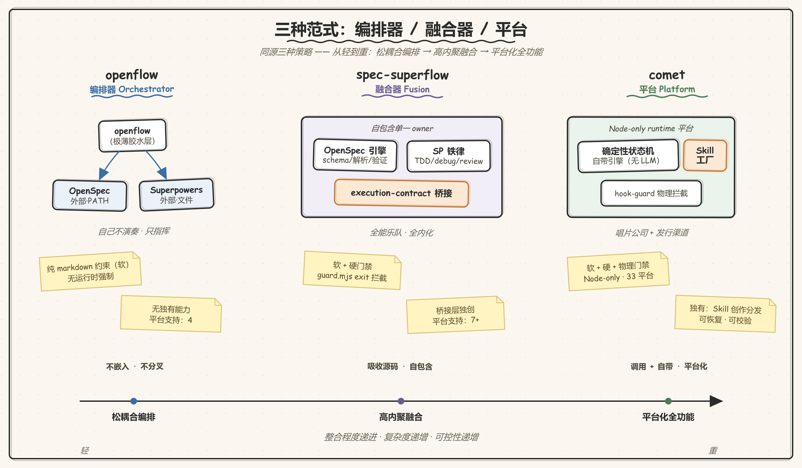
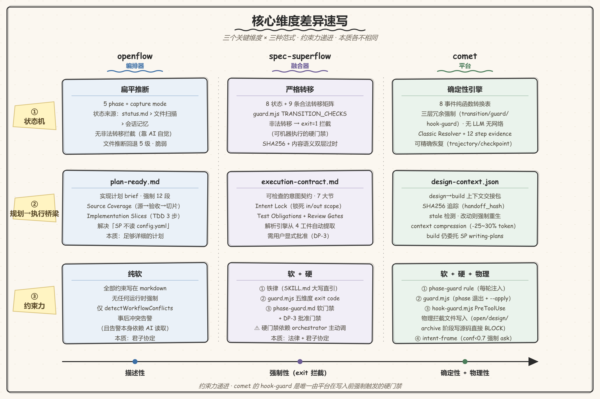
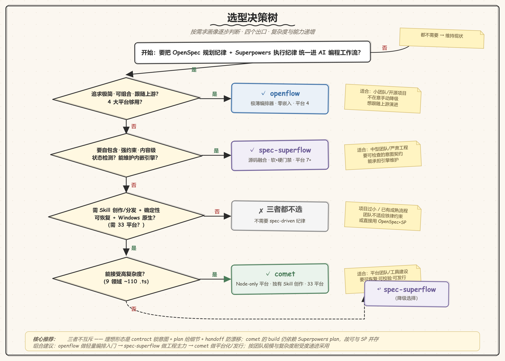

# openflow vs spec-superflow vs comet 三方对比分析报告

> 对比对象：`@lininn/openflow` v0.4.5-beta.0 ｜ `spec-superflow` v0.6.0 ｜ `@rpamis/comet` v0.4.0-beta.1
> 对比维度：实现级（基于三份详细分析报告的素材）
> 生成日期：2026-07-02（在原两方对比基础上纳入 comet 扩展为三方）
> 配套文档：[openflow 详细分析报告](./openflow-详细分析报告.md) ｜ [spec-superflow 详细分析报告](./spec-superflow-详细分析报告.md) ｜ [comet 详细分析报告](./comet-详细分析报告.md)

---

## 目录

1. [对比背景：同源三种范式](#1-对比背景同源三种范式)
2. [核心范式：编排器 / 融合器 / 平台](#2-核心范式编排器--融合器--平台)
3. [全景维度对比表](#3-全景维度对比表)
4. [关键维度深入对比](#4-关键维度深入对比)
5. [优势对比](#5-优势对比)
6. [劣势与风险对比](#6-劣势与风险对比)
7. [共同问题](#7-共同问题)
8. [适用场景决策矩阵](#8-适用场景决策矩阵)
9. [综合建议](#9-综合建议)
10. [结论](#10-结论)

---

## 1. 对比背景：同源三种范式

三者是**同源但策略呈光谱分布**的项目：

- **同源**：三者都试图把 **OpenSpec**（规划引擎，`@fission-ai/openspec`）与 **Superpowers**（执行纪律，`obra/superpowers`）整合成一条 spec-driven 的 AI 编程工作流，引用同一批上游项目。
- **三种策略**：三者对"如何整合 + 整合到什么程度"给出了**从轻到重**的三个答案——openflow 最轻（只编排）、spec-superflow 居中（融合源码）、comet 最重（自成平台）。

| 维度 | openflow | spec-superflow | comet |
|---|---|---|---|
| 上游 OpenSpec | Fission-AI/OpenSpec | Fission-AI/OpenSpec | Fission-AI/OpenSpec（运行时依赖 `^1.5.0`） |
| 上游 Superpowers | obra/superpowers | obra/superpowers | obra/superpowers（`npx skills add` 部署） |
| 整合策略 | **编排器**（不嵌入，调用外部 CLI） | **融合器**（吸收源码，自包含） | **平台**（调用外部 + 自带引擎 + Skill 创作） |
| 作者 | linnn | MageByte | benym |
| 版本 | 0.4.5-beta.0 | 0.6.0 | 0.4.0-beta.1 |

这使三者成为一组绝佳的对照样本——它们回答同一个工程问题：**如何把规划纪律与执行纪律统一到 AI 编程工作流中，并做到什么程度？** 答案从"松耦合编排"→"高内聚融合"→"平台化全功能"递进。

---

## 2. 核心范式：编排器 / 融合器 / 平台



这是理解所有差异的总钥匙。

### 2.1 openflow：编排器（Standalone Orchestrator）

> "openflow 是**独立编排器** — 不捆绑、不分叉、不嵌入任何项目的代码。" —— `openflow/README.zh-CN.md:181`

openflow 把自己定位为**极薄的胶水层**：

- 自身代码只做三件事：**依赖检测、模板生成、状态仪表盘**。
- 业务逻辑全部住在 9 个 markdown 模板里，由 AI 执行。
- OpenSpec 是**外部进程**，运行时通过 PATH 调用 `openspec` CLI。
- Superpowers 是**文件系统中的 skill 文件**，通过存在性检测。
- 任一上游缺失 → 手动降级。

**类比**：openflow 像一个**指挥家**——自己不演奏任何乐器，只负责让 OpenSpec 和 Superpowers 在正确的时刻出场。

### 2.2 spec-superflow：融合器（Source-Level Fusion）

> "它不是把 OpenSpec 和 Superpowers 并排安装再手工拼接，而是把两者的核心引擎和能力**吸收进一个自包含的工作流 owner**。" —— `spec-superflow/README.md:38`

spec-superflow 把自己定位为**自包含的单一 owner**：

- **吸收 OpenSpec 引擎**：用 TypeScript 重新实现 schema/parsing/validation，含中英文双语 tokenizer。
- **吸收 Superpowers 纪律**：把 TDD/根因调试/验证铁律改写进 9 个 SKILL.md。
- **独创桥接层**：`execution-contract.md`，把 4 个规划工件压缩成可检查的执行契约。
- **零运行时依赖**：clone 即用，不需要安装 OpenSpec 或 Superpowers。

**类比**：spec-superflow 像一个**全能乐队**——把指挥、规划、演奏、审查全部内化，不依赖任何外部演奏者。

### 2.3 comet：平台（Node Runtime + Skill Engine + Authoring）

> "0.4.0 它对外应该被理解为一个**只依赖 Node.js、支持可恢复工作流、并且能够创作与分发 Skill 的运行时平台**。" —— `comet/docs/architecture/ARCHITECTURE.md:7`

comet 把自己定位为**Agent Skill 运行时平台**——比前两者都重，且具备两者都没有的 Skill 创作能力：

- **Node-only runtime**：7 个 `.mjs` 启动器由 TypeScript 源码（`domains/comet-classic/`）esbuild 打包，只依赖 Node.js，Windows 原生可用。
- **确定性状态机引擎**：8 个 transition 事件 + Classic Resolver + 12 step evidence 契约，纯函数无 LLM。
- **调用 + 自带并存**：archive 仍调用外部 OpenSpec CLI（如 openflow），但状态机/引擎/校验全部自带（强于 spec-superflow 的单文件 guard）。
- **Skill 创作 + 分发**：`/comet-any` + Bundle 控制平面，把"工作流想法"变成可分发给 33 个平台的 Skill 产物。

**类比**：comet 像一个**自带录音棚和发行渠道的唱片公司**——不仅指挥和演奏，还能把演奏固化成可复制、可校验、可发行的"唱片"（Skill Package），并分发到 33 个"电台"（平台）。

### 2.4 范式差异的本质

| 对比点 | 编排器（openflow） | 融合器（spec-superflow） | 平台（comet） |
|---|---|---|---|
| 与上游的关系 | 调用 | 吸收 | 调用 + 自带引擎 |
| 上游版本跟随 | 自动（调用最新 CLI） | 手动（重新吸收） | OpenSpec 自动跟随；Superpowers 经 `npx skills add` |
| 上游缺失时 | 降级为手动 | 不存在"缺失" | init 时可选安装；archive 强依赖 OpenSpec |
| 自身代码量 | 极小（模板分发器） | 较大（含完整引擎） | 最大（9 domain ~110 .ts） |
| 约束实现层 | 纯 markdown（软） | 铁律 + guard.mjs（软+硬） | 铁律 + guard + **hook-guard PreToolUse**（软+硬+物理） |
| 独有能力 | 无 | 无 | **Skill 创作与分发** |
| 哲学 | 小而专、可组合 | 大而全、自包含 | 重而强、平台化 |

---

## 3. 全景维度对比表

| 维度 | openflow | spec-superflow | comet |
|---|---|---|---|
| **版本** | 0.4.5-beta.0 | 0.6.0 | 0.4.0-beta.1 |
| **Node 版本** | >=18 | >=22 | >=20 |
| **运行时依赖** | 5 个 UI 库 | **零** | 7 个（openspec/inquirer/commander/yaml 等） |
| **CLI 命令** | `openflow`（init/status/update） | `ssf`（8 子命令） | `comet`（**11 组命令**：init/status/dashboard/doctor/update/uninstall/eval/skill/creator/publish/bundle） |
| **工作流入口** | `/openflow <phase>`（8 阶段命令） | `workflow-orchestrator` skill（单一入口） | `/comet`（intent-frame route，5 阶段 + 2 预设） |
| **阶段/状态** | 8 阶段 | 8 状态机 | 5 阶段 + hotfix/tweak 预设；**8 transition 事件** |
| **Skill 数** | 9 模板 + 8 别名 | 9 skill | 8 workflow skill（中英双语）+ OpenSpec/Superpowers |
| **状态跟踪** | `workflow-status.md`（5 phase + 文件推断） | `.spec-superflow.yaml`（26 字段 + SHA256） | `.comet.yaml` + `.comet/run-state.json` + `state-events.jsonl`（三文件解耦） |
| **规划→执行桥梁** | `plan-ready.md`（实现计划 brief） | `execution-contract.md`（意图锁契约） | `design-context.json` handoff（SHA256 追踪）+ Superpowers plan |
| **引擎** | 无（调用外部 OpenSpec） | 内嵌 TS 引擎（schema/parsing/validation） | **确定性 TS 状态机 + Skill Engine**（Resolver/Run/Trajectory/Checkpoint/Guardrails/runtime eval） |
| **Schema 验证** | 委托 `openspec validate --strict` | 内嵌 Validator（双语） | `comet-yaml-validate.mjs`（字段 schema）+ transition/guard（语义约束）+ OpenSpec validate |
| **约束强度** | 软（markdown + 事后冲突检测） | 软+硬（铁律 + guard.mjs exit code + DP-3） | 软+硬+**物理**（铁律 + guard + **hook-guard PreToolUse 拦截**） |
| **过时检测** | 文件存在性推断 | SHA256 + 内容语义 | SHA256 handoff stale 检测 + Resolver evidence 契约 |
| **执行模式** | 委托 Superpowers（build） | TDD + SDD 双层审查（内嵌） | subagent-driven / executing-plans + review_mode（off/standard/thorough）接管 Superpowers 流 |
| **快速路径** | grill 可选；amend 受控 | hotfix（≤2 文件）/ tweak（≤4 文件） | hotfix / tweak 预设 + preset-escalate 合法升级 |
| **平台支持** | 4 | 7+ | **33** |
| **会话引导** | 无 hooks | session-start hooks 自动注入 | PreToolUse hook（hook-guard 写保护）+ 注入 phase-guard rule |
| **Skill 创作** | 无 | 无 | **/comet-any + Bundle（draft/compile/eval/review/publish/distribute）** |
| **可视化** | 无 | 无 | **comet dashboard**（本地 HTTP，React+Tailwind，light/dark） |
| **诊断** | status | `ssf status` | **comet status + comet doctor**（共享证据路径，畸形状态诊断） |
| **测试** | ~32 单元测试 | 1 个 e2e 黑盒 | **99 测试 + coverage 阈值 80** |
| **CI** | ubuntu/Node22，无 OS 矩阵 | ubuntu/Node22，npm publish --provenance | ubuntu/macos/**windows**，3 job（含 init-e2e 33 平台校验）+ eval 回归门 |
| **dist 入库** | 否（templates 随包） | 是（引擎编译产物） | 是（dist + assets/scripts/.mjs + dashboard web） |
| **文档一致性** | 已提交 skills 过期（7 vs 8 阶段） | README 状态数/sync 实现/旧 skill 数三处漂移 | CLAUDE.md runtime 描述过时（单 bundle vs 每命令独立 bundle） |

---

## 4. 关键维度深入对比



### 4.1 状态机：扁平推断 vs 严格转移 vs 确定性引擎

**openflow** 状态模型扁平：5 phase + capture mode；状态来源优先级 workflow-status.md > 文件扫描 > 会话记忆；**无非法转移拦截**，靠 AI 读 SKILL.md 写入边界表自觉执行；文件推断回退阶梯（5 级）简单但脆弱。

**spec-superflow** 状态严格：8 状态 + 9 条合法转移矩阵（`guard.mjs TRANSITION_CHECKS`）；非法转移 → exit=1 拦截（**可机器执行的硬门禁**）；双层过时检测 SHA256 + 内容语义。

**comet** 状态是**确定性 TS 引擎**：8 个 transition 事件驱动的纯函数转换表（`classic-transitions.ts`），三层冗余强制（transition 入口 + guard + hook-guard）；Classic Resolver 推 currentStep + 12 step evidence 契约（纯函数，无 LLM）；三文件解耦（用户字段/引擎字段/审计日志）支持精确恢复。

> **关键差异**：三者约束力递进——openflow"描述性"（告诉 AI 在哪/去哪）、spec-superflow"强制性"（exit code 拦截非法转移）、comet"确定性 + 物理性"（纯函数状态机 + PreToolUse 物理拦截写入）。comet 还独有"可精确恢复"（trajectory/checkpoint）。

### 4.2 规划→执行桥梁：plan-ready.md vs execution-contract.md vs design-context handoff

**openflow `plan-ready.md`**：详尽实现计划，强制 12 段，重点是 Source Coverage（源→验收点→切片）+ Implementation Slices（每 slice 含 TDD 3 步）。解决"Superpowers 不读 config.yaml"问题。本质：**一份足够详细的计划文档**。

**spec-superflow `execution-contract.md`**：可检查的意图契约，7 大节，重点是 Intent Lock（锁死 in/out scope）+ Test Obligations + Review Gates。解析引擎从 4 工件自动提取字段，需用户显式批准（DP-3）。本质：**一份可被 guard 检查、锁死意图的契约**。

**comet `design-context.json` handoff**：design→build 上下文包，SHA256 追踪（handoff_context + handoff_hash），支持 context compression（off/beta，beta 投影 delta spec 全文，省 25-30% token）。stale 检测——artifact 改动后 hash 不匹配则强制重生。本质：**一份带防漂移哈希、可压缩、可追溯的上下文交接包**（实际 build 仍委托 Superpowers `writing-plans` 生成 plan）。

> **关键差异**：openflow 偏"计划详尽性"，spec-superflow 偏"意图约束性"，comet 偏"防漂移追溯性"。三者不互斥——理想形态是 contract 锁意图 + plan 给细节 + handoff 防漂移。comet 的 build 仍依赖 Superpowers plan，故其 handoff 更接近 openflow 的 plan-ready 角色，但多了哈希校验。

### 4.3 引擎与验证：外部委托 vs 内嵌重实现 vs 确定性状态机 + 外部委托

**openflow**：无自有引擎，Schema 验证完全委托 `openspec validate --strict`。永远跟随上游，零维护；但必须装 OpenSpec，Windows 有 PATHEXT 隐患。

**spec-superflow**：内嵌完整引擎（schema/parsing/validation + 双语 tokenizer）。自包含、可做三维验证、支持中文；但需手动跟随上游演进，维护成本高，测试覆盖薄。

**comet**：**混合策略**——工作流状态机/引擎/校验全部自带（确定性 TS，无 LLM），但 archive 仍调用外部 `openspec archive` CLI 做 delta→main spec merge（`classic-archive.ts:296`）。自带 7 个确定性 runtime eval（迁移/重试路由/handoff 恢复/归档恢复/畸形拒绝/幂等/契约保持）做差分兼容测试。

> **关键差异**：openflow 全"调用"，spec-superflow 全"拥有"，comet"关键路径自带 + 边界调用"——在可控性与上游跟随之间取折中。

### 4.4 约束力：纯软 vs 软+硬 vs 软+硬+物理

这是三者**最实质的差异**，决定"AI 不听话时会发生什么"。

**openflow**：全部约束写在 markdown；**没有任何运行时强制**，只有 `detectWorkflowConflicts` 事后冲突告警（且告警本身依赖 AI 读取）。

**spec-superflow**（三层）：① 铁律（SKILL.md 大写直引 + Red Flags）② guard.mjs 硬门禁（五维度 exit code 拦截）③ phase-guard.md 软门禁 + DP-3 批准门禁。硬门禁依赖 orchestrator 主动调用。

**comet**（四层）：① phase-guard rule（每轮注入软防线）② guard.mjs（phase 退出条件 + `--apply` 写状态）③ **hook-guard.mjs PreToolUse hook（物理拦截文件写入——open/design/archive 阶段写源码直接 BLOCK）** ④ intent-frame routing（confidence<0.7 强制 ask_user）。其中 hook-guard 是**唯一不依赖 agent 主动调用**的硬门禁——PreToolUse 由平台在写入前触发。

> **关键差异**：约束力递进 openflow（君子协定）< spec-superflow（法律 + 君子协定，但法律需主动调用）< comet（法律 + 君子协定 + 物理门禁，其中 hook-guard 由平台强制触发）。但要注意：comet 的 guard/state 转换仍需 agent 主动调 `.mjs`；若 agent 跳过 `guard --apply` 直接手编 `.comet.yaml` 的非 phase 字段，仍可能绕过（phase 字段本身有 set 拒绝保护）。

### 4.5 执行纪律：委托 vs 内化 vs 委托 + 接管

**openflow**：build 阶段委托 Superpowers `writing-plans` + `subagent-driven-development`；Superpowers 缺失 → 手动降级。

**spec-superflow**：内化全部执行纪律（TDD + SDD 双层审查 + Review Gate + 进度台账），执行模式自动选择，自身就是执行 owner。

**comet**：build 仍委托 Superpowers（`writing-plans`/`subagent-driven-development`/`test-driven-development`/`using-git-worktrees`），但用 **review_mode 接管 Superpowers 默认流**（防双重审查）：off/standard/thorough 决定派哪些 task 的 reviewer，change 总审查数仅由 review budget 表决定；subagent-dispatch 是 Superpowers 的 Comet 扩展（per-task checkpoint、coordinator-only source、review-fix 轮次上限、连续执行）。

> **关键差异**：openflow 全外包，spec-superflow 全自营，comet 外包但"接管指挥权"——保留 Superpowers 的执行能力，但用 review_mode 和 subagent-dispatch 协议覆盖其默认审查/调度策略。

### 4.6 平台与会话引导

**openflow**：4 平台（Claude Code/Codex/Cursor/OpenCode），靠 `--tools` 生成 skills；可见性别名机制；**无 session-start hooks**，需手动 `/openflow`。

**spec-superflow**：7+ 平台，manifest + hooks 单源多平台；**session-start hooks 自动注入** orchestrator。

**comet**：**33 平台**（含 ZCode/MimoCode/Trae-CN/Antigravity 2.0 等长尾），单一 `PLATFORMS` 数组定义；copy vs symlink 安装模式；OpenSpec 输出镜像（opencode→zcode/mimocode）+ Superpowers staging（lingma/zcode/mimocode 经 claude-code staging）；**PreToolUse hook-guard 写保护** + 注入 phase-guard rule；支持 `npx skills add rpamis/comet` 通用安装。

> **关键差异**：comet 平台覆盖（33）远超另两者，且安装机制最精细（symlink/staging/mirror/字段级 merge config）。三者会话引导方式不同：openflow 无、spec-superflow session-start 注入、comet PreToolUse 拦截。

### 4.7 独有能力：Skill 创作（仅 comet）

这是 comet 的**决定性差异**——openflow 和 spec-superflow 都只能消费预置工作流命令，comet 能造自己的 Skill 并分发。

comet 的 `/comet-any` + Bundle 控制平面：候选发现 → confirmable proposal（哈希锁定）→ 6 lane authoring DAG（deterministic backbone + content leaves 分离）→ 确定性渲染（workflow-protocol.json 单一事实源）→ eval 证据（stale-hash 拒绝）→ review 审批 → publish（hash 三处一致）→ distribute（33 平台，hook 非破坏性合并）。这让 comet 从"消费者工具"升级为"Skill 生态平台"。

---

## 5. 优势对比

### 5.1 openflow 的独特优势

| 优势 | 说明 |
|---|---|
| **真正的松耦合** | 零上游代码依赖，任一缺失都能降级，安装/迁移成本低 |
| **自动跟随上游** | 调用外部 CLI，永远用 OpenSpec 最新规则，零引擎维护 |
| **指令即产品** | 业务逻辑全在 markdown，可读、可审计、可自行编辑 |
| **极简优雅** | 自身代码量小，复杂度低，易理解和二次开发 |

### 5.2 spec-superflow 的独特优势

| 优势 | 说明 |
|---|---|
| **强约束力（三层守卫）** | guard.mjs 硬门禁 + 铁律 + phase-guard |
| **桥接层独创** | execution-contract.md + 需求覆盖交叉校验 |
| **自包含零依赖** | clone 即用，不需预装上游 |
| **双层过时检测** | SHA256 + 内容语义，兼顾速度与准确性 |
| **双语支持** | 中英文 tokenizer，中文 spec 也能跑 |
| **会话自动化** | session-start hooks 自动注入 |

### 5.3 comet 的独特优势

| 优势 | 说明 |
|---|---|
| **物理级硬约束** | hook-guard PreToolUse 拦截非法写入，约束力最强（§4.4） |
| **确定性可恢复** | 三文件解耦状态 + Resolver + trajectory/checkpoint，长流程精确恢复（§4.1） |
| **Node-only 跨平台** | 彻底消除 Bash/WSL 依赖，CI 含 Windows 矩阵，解决 PATHEXT 隐患 |
| **Skill 创作平台（独有）** | /comet-any + Bundle 把工作流想法变成可分发 Skill（§4.7） |
| **33 平台 + 双语** | 覆盖最广，单源多平台 |
| **诊断一体化** | status/doctor 共享证据路径，畸形状态作为可见诊断而非静默漂移 |
| **工程质量最高** | 99 测试 + coverage 80 + 架构 linter（14 类）+ Windows CI + 4 benchmark + 安全发布检查 |

> **优势对照的本质**：openflow 胜在"**轻、活、纯**"，spec-superflow 胜在"**强、全、稳**"，comet 胜在"**硬、深、广**"（约束最硬、引擎最深、平台最广）。三者形成"轻量灵活 → 自包含强约束 → 平台化全功能"的光谱。

---

## 6. 劣势与风险对比

### 6.1 openflow 的劣势/风险

| 劣势 | 严重度 | 说明 |
|---|---|---|
| **约束全是软约束** | 高 | 无运行时强制，AI 不听话则门禁失效 |
| **Windows PATHEXT 隐患** | 中 | `cmdExists` 不尝试 `.cmd`，win32 可能检测失败 |
| **必须预装上游** | 中 | 不装 OpenSpec（+推荐 Superpowers）则能力残缺 |
| **状态解析脆弱点** | 中 | 子串匹配、零 checkbox 误判、parseTable slice(2) |
| **无会话自动引导** | 低 | 需手动 `/openflow` |

### 6.2 spec-superflow 的劣势/风险

| 劣势 | 严重度 | 说明 |
|---|---|---|
| **重量级** | 高 | 9 skill + 8 状态 + 7 决策点 + contract，对小变更认知负荷高 |
| **ssf sync 实现背离** | 高 | SKILL.md 描述字段级合并，cmd-sync.mjs 实际整文件覆盖 |
| **硬门禁仍依赖调用** | 中 | guard.mjs 只在 orchestrator 显式调用时生效 |
| **引擎需手动跟随上游** | 中 | 内嵌引擎不自动跟随 OpenSpec 演进 |
| **测试覆盖薄** | 中 | 仅 1 个 e2e 黑盒 |

### 6.3 comet 的劣势/风险

| 劣势 | 严重度 | 说明 |
|---|---|---|
| **复杂度最高** | 高 | 9 domain ~110 .ts、11 组 CLI、5 阶段+2 预设+Skill Creator+Bundle+Engine+eval+dashboard，新用户上手成本远超另两者 |
| **仍是 beta** | 中 | 0.4.0-beta.1 是 0.4.0 线首个 beta，部分能力仍在收敛 |
| **guard/state 仍需主动调用** | 中 | hook-guard 是物理门禁，但 phase 转换仍需 agent 主动调 `.mjs`；跳过 `guard --apply` 直接手编非 phase 字段可绕过 |
| **archive 绑定 OpenSpec** | 中 | delta merge 依赖外部 `openspec archive` CLI，OpenSpec 缺失则 archive 路径断（init 可选安装，但非自包含） |
| **handoff stale 严格性** | 低 | artifact 微调后必须重生 handoff 否则 guard design 失败，对 agent 是强约束 |
| **文档漂移** | 低 | CLAUDE.md/AGENTS.md runtime 描述过时（单 bundle vs 每命令独立 bundle） |

> **劣势对照的本质**：openflow 风险是"约束太弱导致失控"，spec-superflow 风险是"约束太重 + 实现与文档背离"，comet 风险是"复杂度太高 + 仍是 beta + 部分约束可绕过"。三者共同面临"文档维护滞后于实现"的问题。

---

## 7. 共同问题

尽管策略递进，三者共享一些结构性问题：

| 共同问题 | openflow | spec-superflow | comet |
|---|---|---|---|
| **文档漂移** | 已提交 skills 过期（7 vs 8 阶段） | README 状态数/sync 实现背离 | CLAUDE.md runtime 描述过时 |
| **约束最终部分依赖模型/调用** | 全靠 AI 执行 markdown | 铁律靠 AI；guard 靠 orchestrator 调用 | hook-guard 物理门禁；但 guard/state 转换靠 agent 调 .mjs |
| **快速迭代痕迹** | beta、Unreleased 空、init 未入 CHANGELOG | v0.1 遗留文档、CHANGELOG 与 README 不同步 | 0.4.0-beta.1，0.3.x→0.4.0 大重构进行中 |
| **build 依赖 Superpowers** | 是（build 阶段委托） | 否（内化） | 是（build 委托，但 review_mode 接管） |
| **概念密度** | 低 | 高（contract/iron law/delta/DP/guard） | **最高**（intent-frame/transition/Resolver/Bundle/Engine/workflow-contract/authoring lane） |

> **共同问题的根因**：三者都是"文档/指令 + 脚本"驱动的工作流，"文档即代码"副作用是漂移风险高；且都处于快速迭代期，文档维护滞后。comet 用架构 linter（14 类规则）+ CI 强制缓解了部分漂移，是三者中最工程化应对的。

---

## 8. 适用场景决策矩阵

### 8.1 选 openflow 当…

| 场景 | 理由 |
|---|---|
| 已深度使用 OpenSpec + Superpowers | 几乎零成本串联，不改变既有栈 |
| 团队多 AI 工具混用（4 平台内） | 同套指令分发 |
| 希望工作流可读、可审计、可自定义模板 | 业务逻辑全在 markdown |
| 偏好轻量、小而专、需要灵活度 | 极简编排器，软约束给 AI 较大裁量权 |

### 8.2 选 spec-superflow 当…

| 场景 | 理由 |
|---|---|
| 大型功能开发，需要强门禁防跑偏 | guard.mjs + contract 三层守卫 |
| 多人协作，需要明确协作合约 | execution-contract.md 可检查 |
| 长期维护项目，担心规范腐烂 | spec-syncer + delta spec |
| 棕地项目 / 中文项目 | spec-explorer 先查代码；双语 tokenizer |
| 希望开箱即用、不预装上游 | 自包含零依赖 |

### 8.3 选 comet 当…

| 场景 | 理由 |
|---|---|
| **需要创作并分发自己的 Skill** | /comet-any + Bundle 是三者唯一的 Skill 创作能力（决定性理由） |
| Windows 环境 / 跨平台团队 | Node-only 无 Bash 依赖，CI 实测 Windows |
| 需要 33 平台广覆盖 | 含 ZCode/MimoCode/Trae-CN/Antigravity 等长尾平台 |
| 长流程需要精确恢复 | 三文件解耦状态 + trajectory/checkpoint |
| 需要最强约束（物理门禁） | hook-guard PreToolUse 拦截 |
| 需要可视化诊断 | comet dashboard + doctor 诊断路径 |
| 团队能承受高复杂度 | 9 domain 概念密度大，需投入学习 |

### 8.4 三者都不选当…

| 场景 | 建议 |
|---|---|
| 快速原型 / Demo | 直接用 Claude Code 默认行为 |
| 小改动（< 100 行） | 直接改代码 + 测试 |
| 探索性开发 | 用 Superpowers 或 OpenSpec 单一框架 |

---

## 9. 综合建议



### 9.1 选型建议（决策树）

```
你是否需要"创作并分发自己的 Skill"？
├─ 是 → comet（三者唯一具备 Skill 创作能力）

你是否已深度使用 OpenSpec + Superpowers，且只想轻量串联？
├─ 是，追求轻量灵活 → openflow
├─ 是，但追求强约束自包含 → spec-superflow

你的运行环境？
├─ Windows 为主 / 跨平台 → comet（Node-only，CI 实测 Windows）或 spec-superflow（零依赖）
├─ 纯 Linux/macOS → 三者皆可

你需要多大平台覆盖？
├─ ≤4 → openflow
├─ 7+ → spec-superflow
└─ 33（含长尾）→ comet

你的变更规模与团队？
├─ 小到中、求轻 → openflow
├─ 大型/多人/需合约 → spec-superflow
└─ 大型 + 需 Skill 资产化 + 能承受复杂度 → comet
```

### 9.2 核心推荐

- **如果你是"工具整合者"** —— 已投资 OpenSpec + Superpowers，想要一条把它们串起来的轻量流水线，团队有维护能力：**选 openflow**。松耦合、可审计、不重复造轮子。

- **如果你是"工作流 owner"** —— 想要开箱即用、强约束、自包含，项目规模足以支撑其重量，尤其中文/棕地/多人协作：**选 spec-superflow**。桥接层和三层守卫是真正的工程化创新。

- **如果你是"Skill 平台建设者"** —— 不只想消费工作流，还想把团队的工作流沉淀成可复用、可评审、可分发的 Skill 资产，跨多平台分发，且能承受工程复杂度：**选 comet**。它的 Skill 创作产线、确定性状态机、物理级约束、33 平台覆盖是另两者完全没有的维度。

### 9.3 组合与互补建议

三者并非完全互斥，可考虑互补思路（需自行验证）：

1. **借鉴 comet 的 hook-guard 给 openflow/spec-superflow**：把关键 gate（如"plan-ready/contract 缺失则禁写源码"）做成 PreToolUse hook，从"靠 agent 调用"升级为"平台物理拦截"——这是约束力最实质的提升。
2. **借鉴 comet 的确定性状态机给 spec-superflow**：spec-superflow 的 guard 是单文件命令式，可升级为纯函数转换表 + Resolver evidence 契约（如 comet 的 12 step evidence），让约束可被确定性测试覆盖。
3. **借鉴 spec-superflow 的 execution-contract 给 comet/openflow**：comet 的 handoff 偏"上下文交接"，openflow 的 plan-ready 偏"计划详尽"，都可叠加 contract 的"意图锁 + 用户批准门禁"理念。
4. **借鉴 openflow 的松耦合给 comet**：comet 的 archive 强绑定 OpenSpec CLI，可考虑"自包含 delta merge + 调用 OpenSpec"可切换策略，降低外部依赖。

### 9.4 各自的改进建议

**给 openflow 的建议（按优先级）**：
1. **修复 Windows PATHEXT 隐患**（高）：`cmdExists` 尝试 `.cmd/.ps1/.bat`，加 Windows CI 矩阵（comet 已示范）。
2. **增加可机器执行的硬门禁**（高）：借鉴 comet hook-guard，把"plan-ready 缺失则禁 build"做成 PreToolUse hook。
3. **修复已提交 skills 过期**（高）：补测试校验已提交产物与 templates 一致。

**给 spec-superflow 的建议（按优先级）**：
1. **修复 ssf sync 实现背离**（高）：让 cmd-sync.mjs 实现字段级合并，或修正 SKILL.md。
2. **补齐测试**（高）：为 guard/state-loader/cmd-sync/tokenizer 增加单测（comet 有 99 测试可参考）。
3. **guard 自动调用保障**（中）：考虑在 hooks 中强制调用 guard.mjs。

**给 comet 的建议（按优先级）**：
1. **降低入口复杂度**（高）：把 hotfix/tweak 作为默认推荐入口，full + Skill Creator 作为进阶；提供"快速上手路径"。
2. **修复文档漂移**（中）：同步 CLAUDE.md/AGENTS.md 的 runtime 架构描述（每命令独立 bundle，非单 comet-runtime.mjs）。
3. **加固状态写入**（中）：考虑把 phase 转换也从"agent 调 .mjs"升级为更难绕过的机制（如 hook 强制 guard 前置）。
4. **archive 路径自包含选项**（低）：考虑自带简化 delta merge，OpenSpec 缺失时降级而非断路。

---

## 10. 结论

三者是同一工程问题的**三个递进答案**：

> **如何把规划纪律（OpenSpec）与执行纪律（Superpowers）统一到 AI 编程工作流中，并做到什么程度？**

- **openflow** 给出"**编排器**"答案：松耦合、轻量、纯粹调度、自动跟随上游、约束靠自觉。优雅、灵活、易扩展，但约束力弱、依赖外部、Windows 有现实隐患。适合**已投资上游、追求轻量灵活、团队有维护能力**的场景。

- **spec-superflow** 给出"**融合器**"答案：高内聚、自包含、强约束、独创桥接层、三层守卫。工程化程度高、约束力真实、开箱即用、支持中文，但重量级、概念密度高、存在实现与文档背离。适合**大型/多人/长期项目、需强门禁、不愿预装上游**的场景。

- **comet** 给出"**平台**"答案：Node-only 运行时 + 确定性状态机引擎 + 物理级约束 + Skill 创作分发 + 33 平台覆盖。约束最强（hook-guard 物理拦截）、可精确恢复、工程质量最高、独有 Skill 资产化能力，但复杂度最高、仍是 beta、部分约束可绕过、archive 绑定 OpenSpec。适合**需要 Skill 创作分发、Windows/跨平台、长流程恢复、广平台覆盖、能承受复杂度**的场景。

**没有绝对的胜者**——三者是"轻量灵活 vs 自包含强约束 vs 平台化全功能"的经典工程权衡光谱，复杂度与能力同步递增。选型应基于：是否需要 Skill 创作（comet 独有）、团队既有工具栈、运行平台、约束强度需求、平台覆盖需求、以及团队对复杂度的承受力。

**一个值得关注的趋势**：三者的优势其实是互补的——openflow 的松耦合 + spec-superflow 的 execution-contract 桥接层 + comet 的 hook-guard 物理门禁与确定性状态机，理论上可以融合成"轻量编排 + 可选硬门禁（物理级）+ 意图契约 + 确定性可恢复"的更优形态。如果要从三者中汲取灵感设计下一代工作流，**comet 的 hook-guard + 确定性状态机**（约束与可恢复）、**spec-superflow 的 execution-contract**（意图锁）、**openflow 的松耦合**（可组合性）是最值得组合的三件套。

---

> **附**：本报告基于三份实现级详细分析报告，所有结论均可在配套文档中找到文件级证据支撑。
> - [openflow 详细分析报告](./openflow-详细分析报告.md)
> - [spec-superflow 详细分析报告](./spec-superflow-详细分析报告.md)
> - [comet 详细分析报告](./comet-详细分析报告.md)
